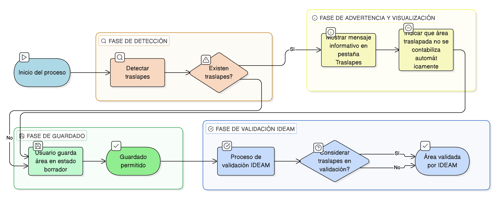

# HU-IDEAM-SNIF-REST-193

> **Identificador Historia de Usuario:** hu-ideam-snif-rest-193\
> **Nombre Historia de Usuario:** Validar impacto de traslapes en el proceso de creación

> **Sistema de información:** Sistema Nacional de Información Forestal\
> **Módulo / subsistema:** Módulo de restauración\
> **Validador temático(s):** Raymond Alexander Jiménez Arteaga

## DESCRIPCIÓN HISTORIA DE USUARIO

> **Como:** sistema\
> **Quiero:** advertir al usuario cuando existan traslapes\
> **Para:** evitar inconsistencias en la información

## CRITERIOS DE ACEPTACIÓN

1. **Detección de traslapes**\
    1.1 Si el sistema detecta traslapes, debe ejecutar las siguientes acciones:
    
    - Mostrar un **mensaje informativo** en la pestaña **Traslapes**.  
    - Indicar que el **área traslapada no se contabiliza automáticamente** (si aplica a la lógica del proyecto).

2. **Comportamiento frente al guardado**\
    2.1 La existencia de traslapes:
    
    - **No debe bloquear** el guardado del área en estado **BORRADOR**.  
    - **Puede ser considerada** durante la **validación IDEAM**.

## ROLES

- **Sistema**: Ejecuta la validación y genera las advertencias correspondientes.

## RESTRICCIONES Y LÍMITES

- La detección de traslapes solo genera advertencias informativas.
- El guardado en estado borrador no debe verse bloqueado por la existencia de traslapes.
- La consideración de los traslapes queda sujeta al proceso de validación IDEAM.
- Los mensajes deben ser claros para el usuario.

## DIAGRAMA DE FLUJO DEL PROCESO

