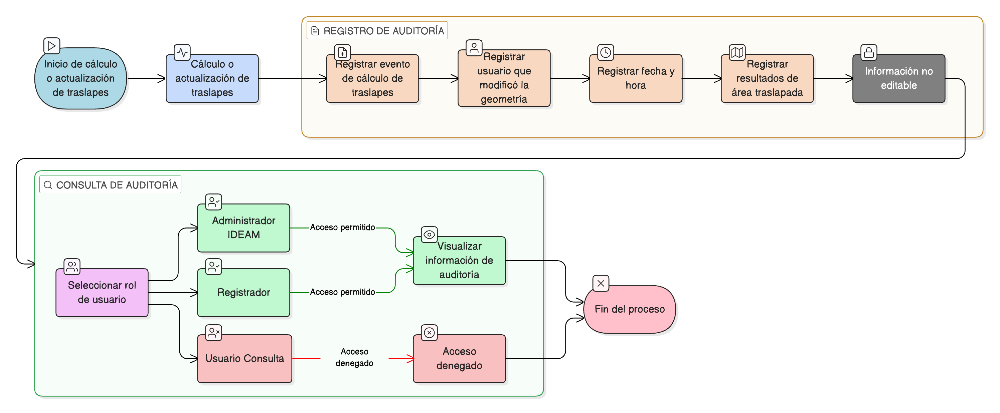

# HU-IDEAM-SNIF-REST-194

> **Identificador Historia de Usuario:** hu-ideam-snif-rest-194\
> **Nombre Historia de Usuario:** Registrar auditoría del cálculo de traslapes

> **Sistema de información:** Sistema Nacional de Información Forestal\
> **Módulo / subsistema:** Módulo de restauración\
> **Validador temático(s):** Raymond Alexander Jiménez Arteaga

## DESCRIPCIÓN HISTORIA DE USUARIO

> **Como:** sistema\
> **Quiero:** registrar en auditoría el cálculo y actualización de traslapes\
> **Para:** garantizar trazabilidad técnica

## CRITERIOS DE ACEPTACIÓN

1. **Registro en auditoría**\
    1.1 El sistema debe registrar en auditoría la siguiente información:
    
    - **Evento de cálculo de traslapes**  
    - **Usuario que modificó la geometría** (si aplica)  
    - **Fecha y hora**  
    - **Resultados** (área traslapada)

2. **Consulta de auditoría**\
    2.1 La auditoría debe ser de **solo consulta**.

## ROLES

- **Sistema**: Registra automáticamente la auditoría del cálculo de traslapes.
- **Administrador IDEAM**: Consulta la auditoría.
- **Registrador**: Puede consultar la auditoría.
- **Usuario Consulta**: No tiene acceso a la auditoría.

## RESTRICCIONES Y LÍMITES

- Todo cálculo o actualización de traslapes debe generar un registro de auditoría.
- La información registrada en auditoría no debe ser editable.
- La auditoría es únicamente de consulta.
- Los registros deben conservar la información técnica del evento de cálculo.

## DIAGRAMA DE FLUJO DEL PROCESO

