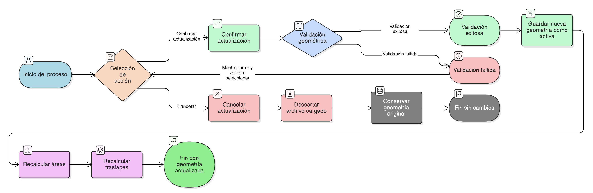

# HU-IDEAM-SNIF-REST-196

> **Identificador Historia de Usuario:** hu-ideam-snif-rest-196\
> **Nombre Historia de Usuario:** Confirmar o cancelar actualización de geometría

> **Sistema de información:** Sistema Nacional de Información Forestal\
> **Módulo / subsistema:** Módulo de restauración\
> **Validador temático(s):** Raymond Alexander Jiménez Arteaga

## DESCRIPCIÓN HISTORIA DE USUARIO

> **Como:** usuario con perfil Registrador.\
> **Quiero:** confirmar o cancelar la actualización de la geometría de un área restaurada.\
> **Para:** asegurar que únicamente se apliquen cambios espaciales correctos y validados.

## CRITERIOS DE ACEPTACIÓN

1. **Disponibilidad de acciones**\
    1.1 Durante el proceso de actualización geométrica, el sistema debe mostrar los botones:

    - Confirmar actualización
    - Cancelar

2. **Confirmar actualización**\
    2.1 Al seleccionar **Confirmar actualización**, el sistema debe ejecutar la validación geométrica definida.\
    2.2 Si la validación es exitosa:

    - La geometría cargada debe guardarse como la nueva versión activa del área restaurada.
    - Se debe ejecutar automáticamente el recalculo de áreas.
    - Se debe ejecutar automáticamente el recalculo de traslapes.

3. **Cancelar actualización**\
    3.1 Al seleccionar **Cancelar**, el sistema debe descartar el archivo geográfico cargado.\
    3.2 No se debe persistir ninguna modificación geométrica.\
    3.3 La geometría original del área restaurada debe conservarse sin alteraciones.

4. **Integridad del proceso**\
    4.1 El sistema debe garantizar que no existan estados intermedios inconsistentes.\
    4.2 Solo una geometría puede quedar activa tras la confirmación.

## ROLES

- **Administrador IDEAM**: No puede realizar esta acción.
- **Registrador**: Puede confirmar o cancelar la actualización de la geometría.
- **Consulta**:	No puede realizar esta acción.

## RESTRICCIONES Y LÍMITES

- No se permite confirmar una actualización sin validación geométrica exitosa.
- El recalculo de áreas y traslapes es obligatorio tras la confirmación.
- No se permiten confirmaciones parciales.
- La cancelación no genera cambios de estado ni registros espaciales.
- Esta HU depende directamente de la - [**HU-IDEAM-SNIF-REST-197:** Validaciones geométricas en carga de archivo](HU-IDEAM-SNIF-REST-197.md).

## DIAGRAMA DE FLUJO DEL PROCESO

