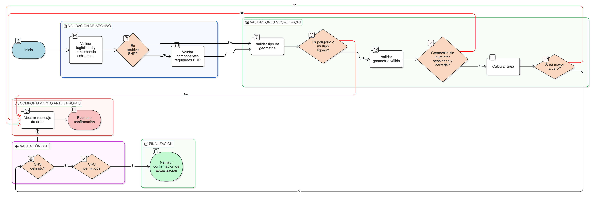

HU-IDEAM-SNIF-REST-197

> **Identificador Historia de Usuario:** hu-ideam-snif-rest-197\
> **Nombre Historia de Usuario:** Validaciones geométricas en carga de archivo

> **Sistema de información:** Sistema Nacional de Información Forestal\
> **Módulo / subsistema:** Módulo de restauración\
> **Validador temático(s):** Raymond Alexander Jiménez Arteaga

## DESCRIPCIÓN HISTORIA DE USUARIO

> **Como:** sistema.\
> **Quiero:** validar automáticamente la geometría cargada desde un archivo geográfico.\
> **Para:** garantizar la integridad espacial y la consistencia técnica de la información antes de su confirmación.

## CRITERIOS DE ACEPTACIÓN

1. **Validación del tipo de geometría**\
1.1 El sistema debe aceptar únicamente geometrías de tipo:

- Polígono
- Multipolígono                      
1.2 Cualquier otro tipo de geometría debe ser rechazado.

2. **Validación de geometría válida**\
2.1 La geometría debe cumplir las siguientes condiciones:
- No presentar autointersecciones. 
- Estar correctamente cerrada.                      
2.2 Geometrías inválidas deben impedir la continuación del proceso.

3. **Validación de área**\
3.1 El área calculada de la geometría debe ser mayor a cero.\
3.2 Geometrías con área igual o menor a cero deben ser rechazadas.

4. **Sistema de referencia espacial (SRS)**\
4.1 El archivo debe contar con un sistema de referencia espacial definido.\
4.2 El SRS debe pertenecer al conjunto de sistemas permitidos por el sistema.

5. **Validación del archivo**\
5.1 El archivo debe ser legible y estructuralmente consistente.\
5.2 Para archivos tipo SHP, el sistema debe validar la presencia de todos los componentes requeridos.

6. **Comportamiento ante errores**\
6.1 Si alguna validación falla:
- Se debe bloquear la opción Confirmar actualización.
- El sistema debe mostrar mensajes de error claros, específicos y orientados al usuario.

7. **Restricción de corrección manual**\
7.1 No se permite ningún tipo de corrección manual de la geometría desde el visor geográfico.

## ROLES

- **Administrador IDEAM**: No interactúa directamente con esta funcionalidad.
- **Registrador**:	Recibe retroalimentación del resultado de la validación.
- **Consulta**: No aplica.

## RESTRICCIONES Y LÍMITES

- Todas las validaciones son automáticas y obligatorias.
- No se permite edición ni corrección gráfica desde el visor.
- No se persisten geometrías inválidas.
- Esta HU es prerrequisito obligatorio para la confirmación de la actualización geométrica.
- La validación garantiza coherencia con procesos de recalculo y auditoría posteriores.

## DIAGRAMA DE FLUJO DEL PROCESO

