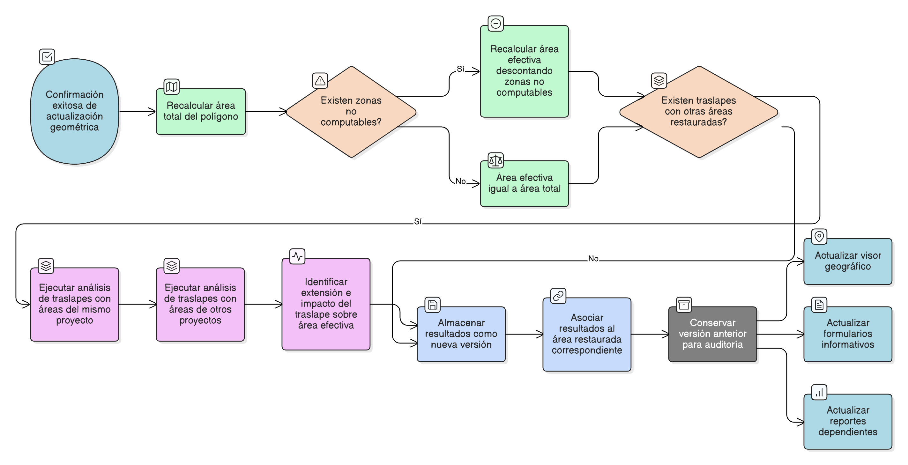

# HU-IDEAM-SNIF-REST-198

> **Identificador Historia de Usuario:** hu-ideam-snif-rest-198\
> **Nombre Historia de Usuario:** Recalcular áreas y traslapes tras actualización geométrica

> **Sistema de información:** Sistema Nacional de Información Forestal\
> **Módulo / subsistema:** Módulo de restauración\
> **Validador temático(s):** Raymond Alexander Jiménez Arteaga

## DESCRIPCIÓN HISTORIA DE USUARIO

> **Como:** sistema.\
> **Quiero:** recalcular automáticamente las áreas y los traslapes cuando se confirma una actualización geométrica.\
> **Para:** mantener la consistencia espacial, evitar doble contabilización y garantizar la integridad de los datos territoriales.

## CRITERIOS DE ACEPTACIÓN

1. **Disparador del recalculo**\
    1.1 El recalculo debe ejecutarse automáticamente al confirmar una nueva geometría.\
    1.2 El proceso no debe requerir intervención manual del usuario.

2. **Recalculo de áreas**\
    2.1 El sistema debe recalcular el área total del polígono en hectáreas (ha).\
    2.2 Cuando aplique, el sistema debe recalcular el área efectiva, descontando zonas no computables según reglas del sistema.

3. **Análisis de traslapes**\
    3.1 El sistema debe ejecutar el análisis de traslapes de la nueva geometría con otras áreas restauradas del mismo proyecto y áreas restauradas de otros proyectos, según reglas definidas.\
    3.2 El análisis debe identificar la extensión del traslape y su impacto sobre el área efectiva.

4. **Persistencia de resultados**\
    4.1 Los valores recalculados deben almacenarse como una nueva versión.\
    4.2 Los resultados deben quedar asociados al área restaurada correspondiente.\
    4.3 La versión anterior debe conservarse únicamente para fines históricos y de auditoría.

5. **Consistencia y disponibilidad**\
    5.1 Los nuevos valores deben reflejarse de forma inmediata en:
    - El visor geográfico.
    - Los formularios informativos del área restaurada.
    - Los reportes dependientes.

## ROLES

- **Administrador IDEAM**:	Consulta resultados y validaciones.
- **Registrador**:	Visualiza los resultados del recalculo.
- **Consulta**:	Visualiza resultados publicados.

## RESTRICCIONES Y LÍMITES

- El recalculo es automático y obligatorio tras una actualización geométrica.
- No se permite modificar manualmente los valores recalculados.
- No se sobrescriben versiones anteriores.
- El análisis de traslapes sigue las reglas espaciales definidas institucionalmente.
- Esta HU depende de la confirmación exitosa de la geometría.

## DIAGRAMA DE FLUJO DEL PROCESO

