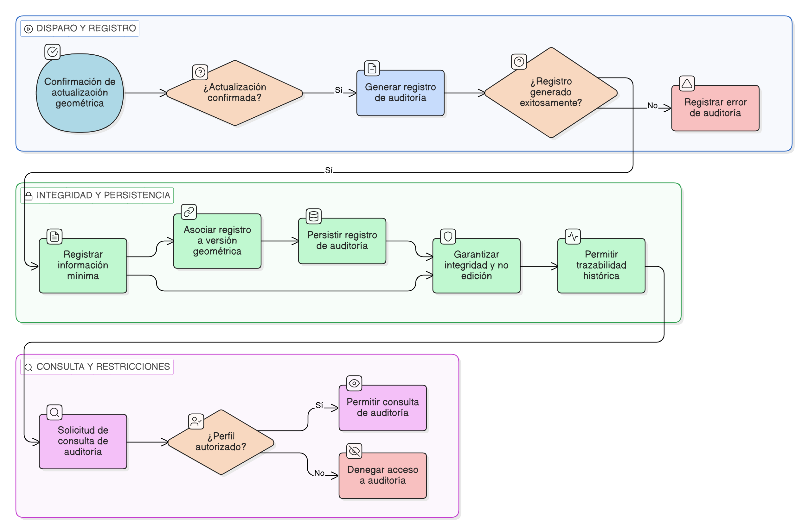

HU-IDEAM-SNIF-REST-199

> **Identificador Historia de Usuario:** hu-ideam-snif-rest-199\
> **Nombre Historia de Usuario:** Registrar auditoría de cambios geométricos

> **Sistema de información:** Sistema Nacional de Información Forestal\
> **Módulo / subsistema:** Módulo de restauración\
> **Validador temático(s):** Raymond Alexander Jiménez Arteaga

## DESCRIPCIÓN HISTORIA DE USUARIO

> **Como:** sistema.\
> **Quiero:** registrar automáticamente cada cambio de geometría realizado sobre un área restaurada.\
> **Para:** garantizar la trazabilidad completa, el control institucional y la transparencia en la gestión de la información espacial.

## CRITERIOS DE ACEPTACIÓN

1. **Disparador del registro de auditoría**\
    1.1 El sistema debe generar un registro de auditoría cada vez que se confirme una actualización geométrica.\
    1.2 El registro debe crearse de forma automática, sin intervención del usuario.

2. **Información registrada**\
    2.1 El registro de auditoría debe contener como mínimo:

    - Identificador del área restaurada.
    - Usuario que realizó la actualización.
    - Fecha y hora del evento.
    - Referencia a la geometría anterior.
    - Referencia a la geometría nueva.
    - Resultado del recalculo de área.
    - Resultado del análisis de traslapes.

3. **Integridad del registro**\
    3.1 El registro de auditoría no debe ser editable bajo ninguna circunstancia.\
    3.2 Los registros deben mantenerse íntegros y persistentes en el tiempo.

4. **Consulta de auditoría**\
    4.1 La auditoría debe estar disponible únicamente en modo consulta.\
    4.2 El acceso a la consulta debe restringirse a perfiles autorizados según política institucional.

5. **Asociación con versiones**\
    5.1 Cada registro de auditoría debe quedar asociado a la versión geométrica generada.\
    5.2 Debe ser posible reconstruir la secuencia histórica de cambios de una geometría.

## ROLES

- **Administrador IDEAM**	Puede consultar los registros de auditoría.
- **Registrador**	No puede consultar ni modificar la auditoría.
- **Consulta**	No puede acceder a la auditoría.

## RESTRICCIONES Y LÍMITES

- La auditoría es obligatoria para toda modificación geométrica confirmada.
- No se permite eliminar ni editar registros de auditoría.
- La auditoría es exclusivamente de consulta institucional (IDEAM).
- Los registros deben permitir trazabilidad completa entre versiones.
- Esta HU depende del recalculo exitoso de áreas y traslapes.

## DIAGRAMA DE FLUJO DEL PROCESO

