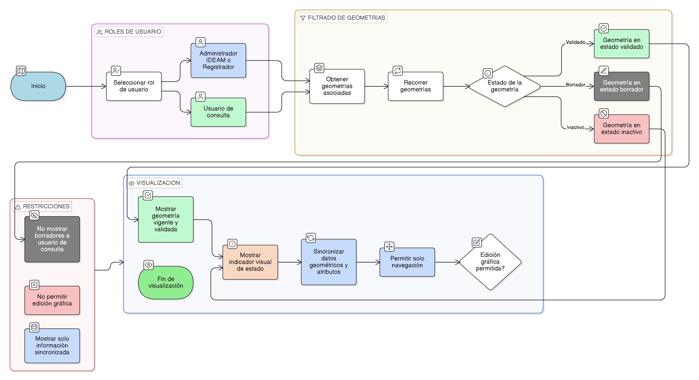

# HU-IDEAM-SNIF-REST-200

> **Identificador Historia de Usuario:** hu-ideam-snif-rest-200\
> **Nombre Historia de Usuario:** Visualizar geometría actualizada en visor geográfico

> **Sistema de información:** Sistema Nacional de Información Forestal\
> **Módulo / subsistema:** Módulo de restauración\
> **Validador temático(s):** Raymond Alexander Jiménez Arteaga

## DESCRIPCIÓN HISTORIA DE USUARIO

> **Como:** usuario del sistema.\
> **Quiero:** visualizar la geometría actualizada de un área restaurada en el visor geográfico.\
> **Para:** consultar su delimitación espacial oficial y el estado vigente del área restaurada.

## CRITERIOS DE ACEPTACIÓN

1. **Geometría visible en el visor**\
    1.1 El visor geográfico debe mostrar únicamente la última geometría validada por IDEAM.\
    1.2 No se deben visualizar geometrías históricas ni versiones en borrador en la vista principal.

2. **Restricción por estado**\
    2.1 Las geometrías en estado BORRADOR no deben ser visibles para usuarios de consulta.\
    2.2 Solo las geometrías con estado validado deben considerarse oficiales para visualización pública.

3. **Indicador visual de estado**\
    3.1 El visor debe mostrar un indicador visual del estado del área restaurada.\
    3.2 El estado debe diferenciar claramente, como mínimo:
    - Borrador
    - Validado
    - Inactivo

4. **Consistencia de la información**\
    4.1 La geometría visualizada debe coincidir con la versión geométrica vigente y los valores de área y traslapes recalculados.\
    4.2 Los datos mostrados deben estar sincronizados con los reportes y formularios informativos.

5. **Modo de visualización**\
    5.1 El visor debe permitir únicamente acciones de navegación (zoom, desplazamiento, encuadre).\
    5.2 No se permite ningún tipo de edición gráfica desde esta vista.

## ROLES

- **Administrador IDEAM**: Visualiza geometrías oficiales y estados.
- **Registrador**:	Visualiza geometrías oficiales y estados.
- **Consulta**:	Visualiza únicamente geometrías validadas.

## RESTRICCIONES Y LÍMITES

- Solo se muestra la geometría vigente validada por IDEAM.
- No se visualizan geometrías en borrador para usuarios de consulta.
- No se permite edición gráfica desde el visor.
- El visor es exclusivamente de consulta y contextualización espacial.
- Esta HU depende de la validación y publicación de la geometría.

## DIAGRAMA DE FLUJO DEL PROCESO

