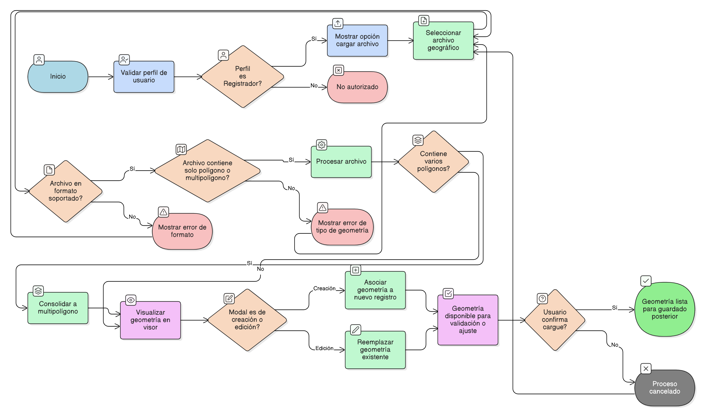

# HU-IDEAM-SNIF-REST-201

> **Identificador Historia de Usuario:** HU-IDEAM-SNIF-REST-201\
> **Nombre Historia de Usuario:** Cargar geometría desde archivo geográfico

> **Sistema de información:** Sistema Nacional de Información Forestal\
> **Módulo / subsistema:** Módulo de restauración\
> **Validador temático(s):** Raymond Alexander Jiménez Arteaga

## DESCRIPCIÓN HISTORIA DE USUARIO

> **Como:** usuario con perfil Registrador.\
> **Quiero:** cargar un archivo geográfico desde el sistema.\
> **Para:** crear o actualizar la geometría de un área restaurada, garantizando la correcta incorporación de información espacial.

## CRITERIOS DE ACEPTACIÓN

1. **Habilitación del cargue de archivo geográfico**\
1.1 El sistema debe mostrar la opción **“Cargar archivo geográfico”** únicamente a usuarios con perfil Registrador.\
1.2 La opción debe estar disponible desde la modal de creación o edición de un área restaurada.

2. **Selección y carga del archivo**\
2.1 El sistema debe permitir seleccionar un archivo geográfico desde el equipo del usuario.\
2.2 El sistema debe aceptar únicamente los siguientes formatos:

- SHP (con todos sus componentes obligatorios)
- GeoJSON
- KML

3. **Procesamiento de la geometría cargada**\
3.1 El sistema debe permitir cargar archivos que contengan uno o varios polígonos.\
3.2 La geometría cargada debe visualizarse en el visor geográfico para su validación previa.\
3.3 En caso de múltiples polígonos, el sistema debe consolidarlos en una única geometría válida (Multipolígono).

4. **Integración con el flujo de edición**\
4.1 Si el cargue se realiza durante la creación, la geometría debe asociarse al nuevo registro del área restaurada.\
4.2 Si el cargue se realiza durante la edición, la geometría cargada debe reemplazar la geometría existente.\
4.3 La geometría cargada debe quedar disponible para validación, ajuste o guardado posterior.

5. **Confirmación del cargue**\
5.1 El sistema debe permitir al usuario confirmar o cancelar el cargue del archivo geográfico.\
5.2 Al confirmar, la geometría debe quedar cargada correctamente en el sistema para su posterior guardado.

## ROLES

- **Administrador IDEAM**: No puede realizar esta acción.
- **Registrador**: Puede cargar archivos geográficos para crear o actualizar la geometría del área restaurada.
- **Consulta**: No puede realizar esta acción.

## RESTRICCIONES Y LÍMITES

- Solo se permite el cargue de archivos en los formatos soportados.
- No se permite el cargue de archivos con geometrías distintas a Polígono o Multipolígono.
- El cargue de archivos no debe modificar atributos no espaciales del área restaurada.
- El cargue no guarda automáticamente la geometría; requiere confirmación posterior del usuario.

## DIAGRAMA DE FLUJO DEL PROCESO

(assets/actividades-hu-ideam-snif-rest-201.png)