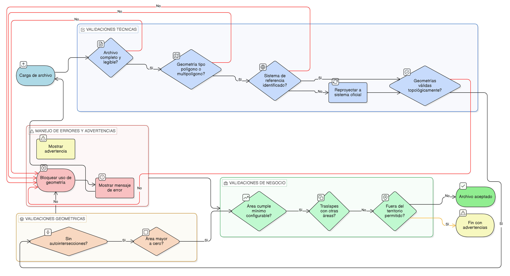

# HU-IDEAM-SNIF-REST-202

> **Identificador Historia de Usuario:** HU-IDEAM-SNIF-REST-202\
> **Nombre Historia de Usuario:** Validaciones del archivo geográfico cargado

> **Sistema de información:** Sistema Nacional de Información Forestal\
> **Módulo / subsistema:** Módulo de restauración\
> **Validador temático(s):** Raymond Alexander Jiménez Arteaga

## DESCRIPCIÓN HISTORIA DE USUARIO

> **Como:** sistema.\
> **Quiero:** validar el archivo geográfico cargado.\
> **Para:** asegurar la calidad, integridad y consistencia de los datos espaciales asociados a un área restaurada.

## CRITERIOS DE ACEPTACIÓN

1. **Validaciones técnicas del archivo**\
    1.1 El sistema debe validar que el archivo geográfico esté completo y sea legible.\
    1.2 El sistema debe validar que las geometrías contenidas sean de tipo Polígono o Multipolígono.\
    1.3 El sistema debe validar que el archivo tenga un sistema de referencia espacial identificado.\
    1.4 Si el sistema de referencia es diferente al oficial, el sistema debe reproyectar automáticamente la geometría al sistema de referencia oficial.\
    1.5 El sistema debe validar que las geometrías sean válidas (sin errores topológicos).

2. **Validaciones geométricas básicas**\
    2.1 El sistema debe validar que las geometrías no presenten autointersecciones.\
    2.2 El sistema debe validar que el área de las geometrías sea mayor a cero.\
    2.3 No se debe permitir continuar el flujo si la geometría es inválida.

3. **Validaciones de negocio**\
    3.1 El sistema debe validar que el área de la geometría cumpla con un valor mínimo configurable.\
    3.2 El sistema debe detectar posibles traslapes con otras áreas restauradas registradas.\
    3.3 El sistema debe identificar si la geometría se encuentra fuera del territorio permitido.

4. **Comportamiento ante errores y advertencias**\
    4.1 Si se presentan errores técnicos o geométricos, el sistema debe bloquear el uso de la geometría cargada.\
    4.2 El sistema debe mostrar mensajes claros y descriptivos indicando el tipo de error detectado.\
    4.3 Las advertencias de negocio (traslapes o ubicación fuera del territorio) deben mostrarse al usuario sin bloquear el flujo, permitiendo la decisión informada.

## ROLES

- **Administrador IDEAM**: No interactúa directamente con esta funcionalidad.
- **Registrador**: Ejecuta indirectamente las validaciones al cargar un archivo geográfico.
- **Consulta**: No interactúa con esta funcionalidad.

## RESTRICCIONES Y LÍMITES

- No se permite utilizar archivos geográficos que no superen las validaciones técnicas y geométricas.
- Las validaciones no deben modificar atributos no espaciales del área restaurada.
- Las advertencias no deben impedir el flujo, salvo que se configure explícitamente como regla de bloqueo.

## DIAGRAMA DE FLUJO DEL PROCESO

