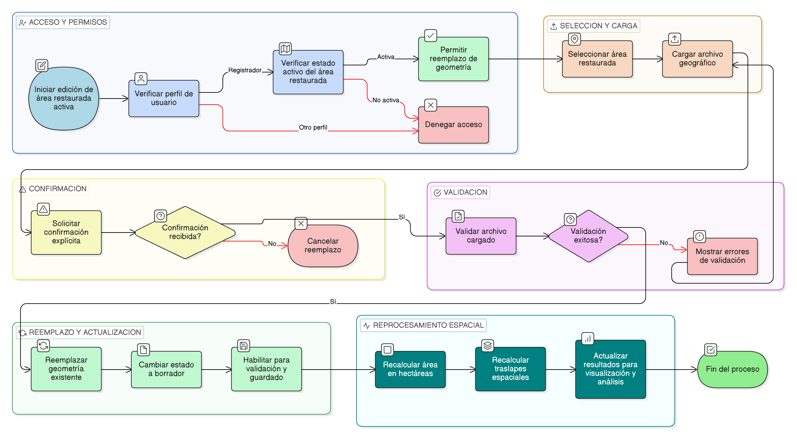

# HU-IDEAM-SNIF-REST-204

> **Identificador Historia de Usuario:** HU-IDEAM-SNIF-REST-204\
> **Nombre Historia de Usuario:** Reemplazar geometría existente mediante cargue de archivo geográfico

> **Sistema de información:** Sistema Nacional de Información Forestal\
> **Módulo / subsistema:** Módulo de restauración\
> **Validador temático(s):** Raymond Alexander Jiménez Arteaga

## DESCRIPCIÓN HISTORIA DE USUARIO

> **Como:** usuario con perfil Registrador.\
> **Quiero:** reemplazar completamente la geometría actual de un área restaurada mediante el cargue de un archivo geográfico.\
> **Para:** actualizar de forma integral la delimitación espacial del área restaurada y sus procesos geoespaciales asociados.

## CRITERIOS DE ACEPTACIÓN

1. **Habilitación del reemplazo de geometría**\
1.1 El sistema debe permitir la opción de reemplazar la geometría existente únicamente a usuarios con perfil Registrador.\
1.2 La opción de reemplazo debe estar disponible desde el flujo de edición del área restaurada.

2. **Confirmación del reemplazo**\
2.1 Antes de ejecutar el reemplazo, el sistema debe solicitar una confirmación explícita al usuario.\
2.2 El mensaje de confirmación debe informar que el reemplazo sobrescribirá completamente la geometría actual.

3. **Ejecución del reemplazo**\
3.1 Al confirmar el reemplazo, la geometría cargada debe sustituir completamente la geometría existente del área restaurada.\
3.2 El sistema debe cambiar automáticamente el estado del área restaurada a BORRADOR.\
3.3 La geometría reemplazada debe quedar disponible para validación y guardado posterior.

4. **Reprocesamiento espacial automático**\
4.1 Una vez realizado el reemplazo, el sistema debe recalcular automáticamente el área del polígono en hectáreas (ha).\
4.2 El sistema debe recalcular los traslapes espaciales asociados a la nueva geometría.\
4.3 Los resultados de los recalculos deben quedar actualizados para su visualización y análisis.

## ROLES

- **Administrador IDEAM**: No puede realizar esta acción.
- **Registrador**: Puede reemplazar la geometría existente mediante cargue de archivo geográfico.
- **Consulta**: No puede realizar esta acción.

## RESTRICCIONES Y LÍMITES

- El reemplazo de la geometría solo puede realizarse sobre áreas restauradas activas.
  No se permite el reemplazo de la geometría sin confirmación explícita del usuario.
- La geometría cargada debe cumplir con las validaciones técnicas, geométricas y de negocio definidas por el sistema.
- El reemplazo de la geometría no debe modificar atributos no espaciales del área restaurada.

## DIAGRAMA DE FLUJO DEL PROCESO

