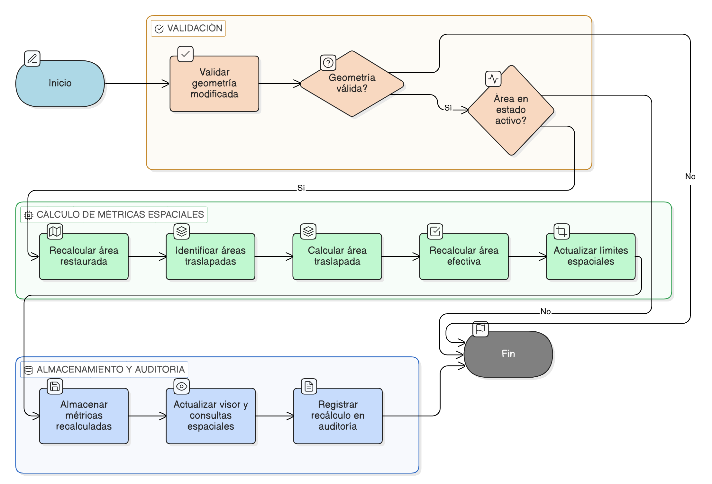

# HU-IDEAM-SNIF-REST-205

> **Identificador Historia de Usuario:** hu-ideam-snif-rest-205\
> **Nombre Historia de Usuario:** Recalcular métricas espaciales automáticamente

> **Sistema de información:** Sistema Nacional de Información Forestal\
> **Módulo / subsistema:** Módulo de restauración\
> **Validador temático(s):** Raymond Alexander Jiménez Arteaga

## DESCRIPCIÓN HISTORIA DE USUARIO

> **Como:** sistema.\
> **Quiero:** recalcular automáticamente las métricas espaciales cuando se modifique la geometría de un área restaurada.\
> **Para:** mantener la consistencia entre la geometría, las métricas espaciales y la información publicada por el sistema.

## CRITERIOS DE ACEPTACIÓN

1. **Disparo automático del recálculo**\
1.1 El sistema debe ejecutar el recálculo de métricas al detectar una modificación de la geometría.\
1.2 El proceso debe realizarse sin intervención manual del usuario.

2. **Recalculo del área restaurada**\
2.1 El sistema debe recalcular el área restaurada a partir de la nueva geometría.\
2.2 El valor debe almacenarse en hectáreas (ha).

3. **Cálculo de área traslapada**\
3.1 El sistema debe identificar traslapes con otras áreas restauradas registradas.\
3.2 El sistema debe calcular el área traslapada resultante.

4. **Cálculo del área efectiva**\
4.1 Cuando aplique, el sistema debe recalcular el área efectiva considerando los traslapes.\
4.2 El valor debe quedar asociado al registro actualizado.

5. **Actualización de límites espaciales**\
5.1 El sistema debe actualizar los límites espaciales derivados de la nueva geometría.\
5.2 Los cambios deben reflejarse en el visor y en las consultas espaciales.

## ROLES

- **Administrador IDEAM**: Supervisa la consistencia técnica de la información espacial.
- **Registrador**: Modifica la geometría mediante carga de archivo geográfico.
- **Sistema**: Ejecuta automáticamente el recálculo de métricas espaciales.

## DIAGRAMA DE FLUJO DEL PROCESO

(assets/actividades-hu-ideam-snif-rest-205.png)