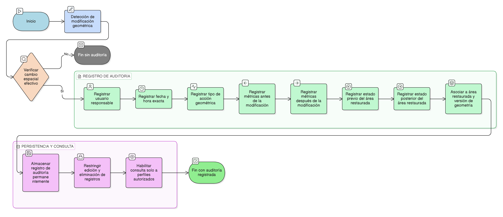

# HU-IDEAM-SNIF-REST-206

> **Identificador Historia de Usuario:** hu-ideam-snif-rest-206\
> **Nombre Historia de Usuario:** Registrar auditoría de edición geométrica

> **Sistema de información:** Sistema Nacional de Información Forestal\
> **Módulo / subsistema:** Módulo de restauración\
> **Validador temático(s):** Raymond Alexander Jiménez Arteaga

## DESCRIPCIÓN HISTORIA DE USUARIO

> **Como:** sistema.\
> **Quiero:** registrar toda modificación realizada sobre la geometría de un área restaurada.\
> **Para:** garantizar la trazabilidad, control y respaldo histórico de los cambios geométricos.

## CRITERIOS DE ACEPTACIÓN

1. **Registro automático de auditoría**\
    1.1 El sistema debe generar automáticamente un registro de auditoría ante cualquier modificación geométrica.\
    1.2 El registro debe realizarse antes de confirmar la actualización definitiva.

2. **Identificación de usuario y fecha**\
    2.1 El sistema debe registrar el usuario que ejecutó la acción.\
    2.2 El sistema debe registrar la fecha y hora exacta de la modificación.

3. **Registro del tipo de acción**\
    3.1 El sistema debe clasificar el tipo de acción geométrica realizada.\
    3.2 Las acciones permitidas son: dibujar, cargar o editar.

4. **Registro de métricas antes y después**\
    4.1 El sistema debe almacenar el área restaurada antes de la modificación.\
    4.2 El sistema debe almacenar el área restaurada después de la modificación.

5. **Registro del estado del área restaurada**\
    5.1 El sistema debe registrar el estado previo del área restaurada.\
    5.2 El sistema debe registrar el estado posterior al cambio geométrico.

6. **Persistencia del historial**\
    6.1 Los registros de auditoría deben almacenarse de forma permanente.
    6.2 Los registros deben estar disponib\es para consulta por perfiles autorizados.

## ROLES

- **Administrador IDEAM**: Consulta y audita el historial de cambios.
- **Registrador**: Realiza modificaciones geométricas autorizadas.
- **Sistema**: Registra automáticamente la auditoría geométrica.

## DIAGRAMA DE FLUJO DEL PROCESO

