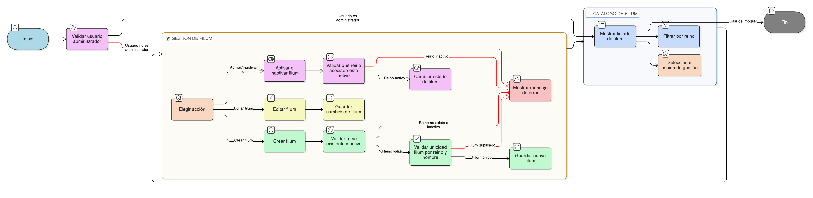

# HU-IDEAM-SNIF-REST208

> **Identificador Historia de Usuario:** hu-ideam-snif-rest-208\
> **Nombre Historia de Usuario:** Administrar filum

> **Sistema de información:** Sistema Nacional de Información Forestal\
> **Módulo / subsistema:** Módulo de restauración\
> **Validador temático(s):** Raymond Alexander Jiménez Arteaga

## DESCRIPCIÓN HISTORIA DE USUARIO

> **Como:** usuario administrador.\
> **Quiero:** administrar los filum asociados a un reino.\
> **Para:** mantener la coherencia y correcta jerarquía taxonómica del sistema.

## CRITERIOS DE ACEPTACIÓN

1. **Vista de catálogo de filum**\
    1.1 El sistema debe presentar una vista tipo catálogo con el listado de filum registrados.\
    1.2 El listado debe permitir filtrar los filum por reino asociado.

2. **Campos visibles en el catálogo**\
    2.1 Cada registro de filum debe mostrar como mínimo los siguientes campos:

    - Reino asociado.
    - Nombre del filum.
    - Estado (activo / inactivo).
    - Fecha de creación.
    - Fecha de actualización.

3. **Creación de filum**\
    3.1 El sistema debe permitir crear un nuevo filum.\
    3.2 El filum debe estar obligatoriamente asociado a un reino existente.\
    3.3 El sistema debe validar la unicidad del filum por combinación (reino + nombre).

4. **Edición de filum**\
    4.1 El sistema debe permitir editar la información del filum.\
    4.2 La edición no debe alterar la jerarquía taxonómica ni afectar registros históricos.

5. **Activación e inactivación de filum**\
    5.1 El sistema debe permitir activar o desactivar un filum.\
    5.2 No se debe permitir activar un filum cuyo reino asociado se encuentre inactivo.

## ROLES

- **Administrador IDEAM**:	Puede crear, editar, activar e inactivar filum.
- **Registrador**:	No puede realizar esta acción.
- **Consulta**:	No puede realizar esta acción.

## RESTRICCIONES Y LÍMITES

- No se permite eliminar filum.
- Todo filum debe estar asociado obligatoriamente a un reino.
- No se permite activar filum asociados a reinos inactivos.
- La inactivación es lógica y controlada.
- La validación de unicidad debe realizarse por (reino + nombre).
- La administración del catálogo es exclusiva del perfil Administrador IDEAM.

## DIAGRAMA DE FLUJO DEL PROCESO

