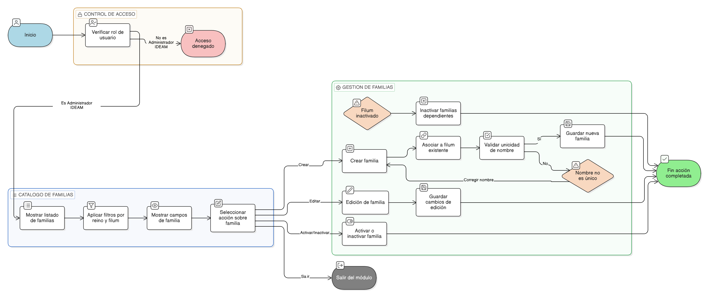

# HU-IDEAM-SNIF-REST-209

> **Identificador Historia de Usuario:** hu-ideam-snif-rest-209\
> **Nombre Historia de Usuario:** Administrar familias

> **Sistema de información:** Sistema Nacional de Información Forestal\
> **Módulo / subsistema:** Módulo de restauración\
> **Validador temático(s):** Raymond Alexander Jiménez Arteaga

## DESCRIPCIÓN HISTORIA DE USUARIO

> **Como: usuario administrador.\
> **Quiero: administrar las familias asociadas a un filum.\
> **Para: garantizar la consistencia y coherencia de la jerarquía taxonómica del sistema.

## CRITERIOS DE ACEPTACIÓN

1. **Vista de catálogo de familias**\
    1.1 El sistema debe presentar un listado tabulado de las familias registradas.\
    1.2 El listado debe permitir filtros por reino y filum asociados.

2. **Campos visibles en el catálogo**\
    2.1 Cada registro de familia debe mostrar como mínimo los siguientes campos:

    - Nombre de la familia.
    - Estado (activo / inactivo).
    - Fecha de creación.
    - Fecha de actualización.

3. **Creación de familias**\
    3.1 El sistema debe permitir crear una nueva familia.\
    3.2 La familia debe estar obligatoriamente asociada a un filum existente.\
    3.3 El sistema debe validar la unicidad del nombre de la familia dentro del filum.

4. **Edición de familias**\
    4.1 El sistema debe permitir editar la información de la familia.\
    4.2 La edición no debe afectar registros históricos asociados.

5. **Activación e inactivación de familias**\
    5.1 El sistema debe permitir activar o desactivar una familia.\
    5.2 Si el filum asociado se inactiva, el sistema debe inactivar lógicamente las familias dependientes.

6. **Persistencia y trazabilidad**\
    6.1 El sistema debe registrar la fecha de creación y actualización de cada familia.\
    6.2 Todas las acciones deben quedar registradas para fines de auditoría.

## ROLES

- **Administrador IDEAM**:	Puede crear, editar, activar e inactivar familias.
- **Registrador**:	No puede realizar esta acción.
- **Consulta**:	No puede realizar esta acción.

## RESTRICCIONES Y LÍMITES

- No se permite eliminar familias.
- Toda familia debe estar asociada obligatoriamente a un filum.
- La inactivación es lógica y controlada.
- Se aplica inactivación lógica en cascada si el filum se inactiva.
- La validación de unicidad debe realizarse por filum.
- La administración del catálogo es exclusiva del perfil Administrador IDEAM.

## DIAGRAMA DE FLUJO DEL PROCESO

