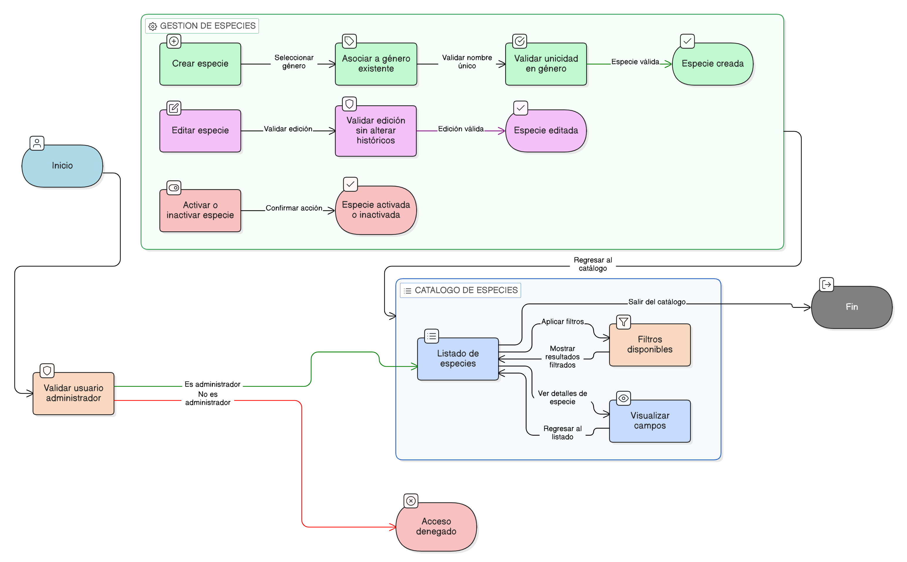

# HU-IDEAM-SNIF-REST-211

> **Identificador Historia de Usuario:** hu-ideam-snif-rest-211\
> **Nombre Historia de Usuario:** Administrar especies

> **Sistema de información:** Sistema Nacional de Información Forestal\
> **Módulo / subsistema:** Módulo de restauración\
> **Validador temático(s):** Raymond Alexander Jiménez Arteaga

## DESCRIPCIÓN HISTORIA DE USUARIO

> **Como:** usuario administrador.\
> **Quiero:** administrar el catálogo maestro de especies.\
> **Para:** que la información biológica pueda ser utilizada de forma consistente en la caracterización de las áreas restauradas.

## CRITERIOS DE ACEPTACIÓN

1. **Vista principal del catálogo de especies**\
1.1 El sistema debe presentar un listado principal de las especies registradas.\
1.2 El listado debe permitir visualizar especies activas e inactivas.

2. **Filtros del catálogo**\
2.1 El sistema debe permitir filtrar las especies por los siguientes criterios:

- Reino.
- Filum.
- Familia.
- Género.
- Estado.

3. **Campos visibles en el catálogo**\
3.1 Cada registro de especie debe mostrar como mínimo los siguientes campos:

- Género asociado.
- Nombre de la especie.
- Estado (activo / inactivo).
- Fecha de creación.
- Fecha de actualización.

4. **Creación de especies**\
4.1 El sistema debe permitir crear una nueva especie.\
4.2 La especie debe estar obligatoriamente asociada a un género existente.\
4.3 El sistema debe validar la unicidad de la especie dentro del género.

5. **Edición de especies**\
5.1 El sistema debe permitir editar la información de la especie.\
5.2 La edición no debe alterar registros históricos asociados.

6. **Activación e inactivación de especies**\
6.1 El sistema debe permitir activar o desactivar una especie.\
6.2 Las especies inactivas no deben mostrarse en los formularios de áreas restauradas.

7- **Persistencia y trazabilidad**\
7.1 El sistema debe registrar la fecha de creación y actualización de cada especie.\
7.2 Todas las acciones deben quedar registradas para fines de auditoría.

## ROLES

- **Administrador IDEAM**:	Puede crear, editar, activar e inactivar especies.
- **Registrador**:	No puede realizar esta acción.
- **Consulta**:	No puede realizar esta acción.

## RESTRICCIONES Y LÍMITES

- No se permite eliminar especies.
- Toda especie debe estar asociada obligatoriamente a un género.
- Las especies inactivas no se muestran en formularios de áreas restauradas.
- La inactivación es lógica y controlada.
- La validación de unicidad debe realizarse por género.
- La administración del catálogo es exclusiva del perfil Administrador IDEAM.

## DIAGRAMA DE FLUJO DEL PROCESO

