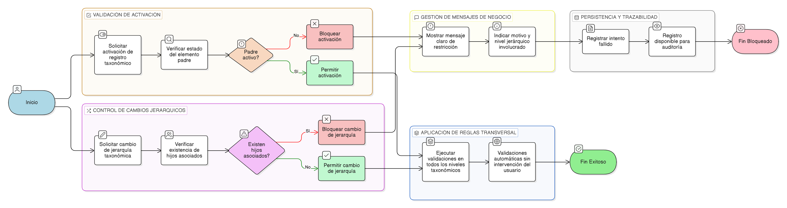

# HU-IDEAM-SNIF-REST-212

> **Identificador Historia de Usuario:** hu-ideam-snif-rest-212\
> **Nombre Historia de Usuario:** Control de dependencias taxonómicas

> **Sistema de información:** Sistema Nacional de Información Forestal\
> **Módulo / subsistema:** Módulo de restauración\
> **Validador temático(s):** Raymond Alexander Jiménez Arteaga

## DESCRIPCIÓN HISTORIA DE USUARIO

> **Como:** sistema.\
> **Quiero:** validar automáticamente la jerarquía taxonómica y sus dependencias.\
> **Para:** evitar inconsistencias en la información biológica utilizada por los módulos operativos y de reporte.

## CRITERIOS DE ACEPTACIÓN

1. **Validación automática de activación por jerarquía**\
    1.1 El sistema debe validar el estado del elemento padre antes de permitir la activación de un  elemento hijo.\
    1.2 No se debe permitir activar un registro taxonómico si su padre se encuentra inactivo.

2. **Control de cambios en la jerarquía**\
    2.1 El sistema debe validar si existen registros dependientes antes de permitir cambios en la jerarquía taxonómica.\
    2.2 No se debe permitir cambiar la jerarquía (padre) cuando existan registros hijos asociados.

3. **Aplicación transversal de reglas**\
    3.1 Las validaciones deben aplicarse a todos los niveles taxonómicos (Reino, Filum, Familia, Género y Especie).\
    3.2 Las reglas deben ejecutarse de forma automática sin intervención del usuario.

4. **Mensajes de negocio claros**\
    4.1 El sistema debe mostrar mensajes claros y comprensibles cuando una acción sea bloqueada por reglas de dependencia.\
    4.2 Los mensajes deben indicar el motivo de la restricción y el nivel jerárquico involucrado.

5. **Persistencia y trazabilidad**\
    5.1 El sistema debe registrar los intentos fallidos de modificación por incumplimiento de reglas.\
    5.2 Los registros deben quedar disponibles para auditoría por perfiles autorizados.

## ROLES

- **Sistema**:	Ejecuta y valida automáticamente las reglas de dependencia taxonómica.
- **Administrador IDEAM**:	Intenta acciones de administración sujetas a validaciones automáticas.
- **Registrador**:	No puede administrar catálogos taxonómicos.
- **Consulta**:	No puede administrar catálogos taxonómicos.

## RESTRICCIONES Y LÍMITES

- No se permite activar un registro hijo si su padre está inactivo.
- No se permite modificar la jerarquía si existen registros dependientes.
- Las validaciones son obligatorias y automáticas.
- Las reglas aplican a todos los niveles taxonómicos.
- Los mensajes de negocio deben ser claros y explícitos.
- El control de dependencias no puede ser deshabilitado.

## DIAGRAMA DE FLUJO DEL PROCESO

