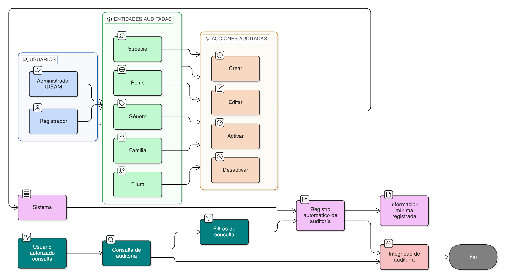

# HU-IDEAM-SNIF-REST-214

> **Identificador Historia de Usuario:** hu-ideam-snif-rest-214\
> **Nombre Historia de Usuario:** Auditoría de catálogos taxonómicos

> **Sistema de información:** Sistema Nacional de Información Forestal\
> **Módulo / subsistema:** Módulo de restauración\
> **Validador temático(s):** Raymond Alexander Jiménez Arteaga

## DESCRIPCIÓN HISTORIA DE USUARIO

> **Como:** sistema.\
> **Quiero:** registrar auditoría de todos los cambios realizados sobre los catálogos taxonómicos.\
> **Para:** garantizar la trazabilidad, control y transparencia de la información administrada.

## CRITERIOS DE ACEPTACIÓN

1. **Cobertura de entidades auditadas**\
1.1 El sistema debe auditar cambios realizados sobre las siguientes entidades:

- Reino
- Filum
- Familia
- Género
- Especie

2. **Eventos auditables**\
2.1 El sistema debe registrar auditoría para las acciones de:

- Crear
- Editar
- Activar
- Desactivar

3. **Información mínima registrada**\
3.1 Cada registro de auditoría debe almacenar obligatoriamente:

- Tipo de entidad afectada.
- Acción ejecutada.
- Usuario que realizó la acción.
- Fecha y hora del evento.
- Valores anteriores.
- Valores nuevos.

4. **Registro automático**\
4.1 El registro de auditoría debe ejecutarse de manera automática, sin intervención del usuario.\
4.2 Ninguna acción válida sobre los catálogos puede ejecutarse sin generar su respectivo registro de auditoría.

5. **Integridad de la auditoría**\
5.1 Los registros de auditoría no deben poder ser modificados ni eliminados por ningún rol.\
5.2 La auditoría debe conservarse incluso si la entidad auditada es desactivada.

6. **Consulta de auditoría**\
6.1 El sistema podrá permitir la consulta de auditoría a usuarios autorizados.\
6.2 La consulta podrá filtrarse por:

- Tipo de entidad
- Acción
- Usuario
- Rango de fechas

## ROLES

- **Administrador IDEAM**:	Ejecuta acciones que generan auditoría.
- **Registrador**:	Ejecuta acciones que generan auditoría (si aplica según HU).
- **Consulta**:	No puede modificar información ni auditoría.
- **Sistema**:	Registra automáticamente todos los eventos de auditoría.

## RESTRICCIONES Y LÍMITES

- No se permite editar ni eliminar registros de auditoría.
- La auditoría es obligatoria para cualquier cambio en catálogos taxonómicos.
- Los valores anteriores y nuevos deben conservarse íntegros.
- Se garantiza trazabilidad completa del ciclo de vida de cada entidad.

## DIAGRAMA DE FLUJO DEL PROCESO

(assets/actividades-hu-ideam-snif-rest-214.png)