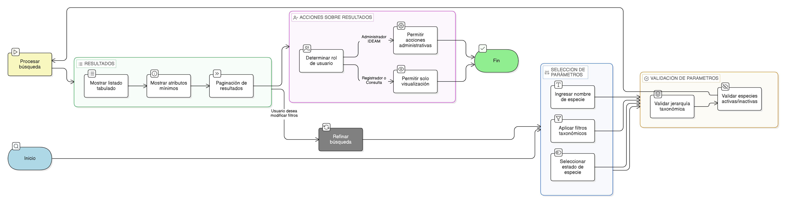

# HU-IDEAM-SNIF-REST-216

> **Identificador Historia de Usuario:** hu-ideam-snif-rest-216\
> **Nombre Historia de Usuario:** Búsqueda avanzada de especies

> **Sistema de información:** Sistema Nacional de Información Forestal\
> **Módulo / subsistema:** Módulo de restauración\
> **Validador temático(s):** Raymond Alexander Jiménez Arteaga

## DESCRIPCIÓN HISTORIA DE USUARIO

> **Como:** usuario del sistema.\
> **Quiero:** buscar especies de forma rápida y flexible dentro del catálogo taxonómico.\
> **Para:** agilizar la administración, consulta y validación de especies en el sistema.

## CRITERIOS DE ACEPTACIÓN

1. **Buscador por nombre**\
    1.1 El sistema debe contar con un campo de búsqueda por nombre de especie.\
    1.2 La búsqueda debe permitir coincidencias parciales.\
    1.3 El buscador no debe retornar especies inactivas para uso operativo, salvo en vistas administrativas o de consulta histórica.

2. **Filtros combinables**\
    2.1 El sistema debe permitir aplicar filtros combinables por: 
    - Reino
    - Filum
    - Familia
    - Género
    - Estado    

    2.2 Los filtros deben respetar la jerarquía taxonómica definida.

3. **Resultados de búsqueda**\
    3.1 Los resultados deben mostrarse en un listado tabulado.\
    3.2 El listado debe incluir como mínimo:

    - Género
    - Nombre de la especie
    - Estado
    - Fechas de creación y actualización     
             
    3.3 Los resultados deben estar paginados.

4. **Permisos por rol**\
    4.1 Las acciones disponibles sobre los resultados deben ajustarse al rol del usuario.\
    4.2 Usuarios sin permisos de edición solo podrán visualizar la información.

## ROLES

- **Administrador IDEAM**:	Puede realizar búsquedas avanzadas y ejecutar acciones administrativas permitidas.
- **Registrador**:	Puede realizar búsquedas y consultar información de especies.
- **Consulta**:	Puede realizar búsquedas y consultar información de especies.

## RESTRICCIONES Y LÍMITES

- La búsqueda no modifica la jerarquía taxonómica.
- Las especies inactivas solo se muestran en contextos administrativos o históricos.
- No se permite edición desde vistas de consulta para roles no administradores.
- Los filtros deben mantener coherencia con las reglas de dependencia taxonómica.

## DIAGRAMA DE FLUJO DEL PROCESO

