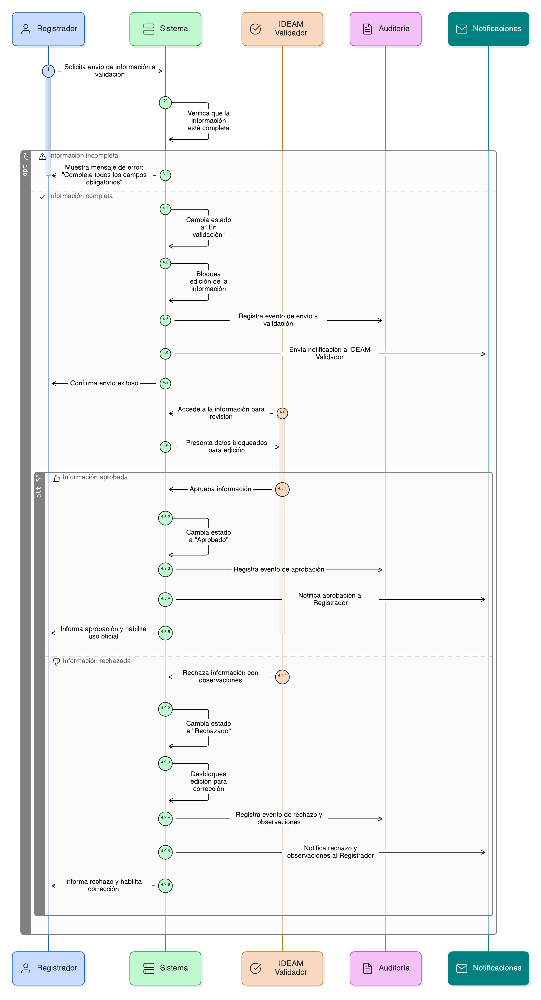

#  Épica 21: Envío a Validación IDEAM (Registrador)

## 1. Descripción general

Esta épica define el proceso de envío a validación IDEAM de la información registrada por el usuario con perfil Registrador, correspondiente a proyectos y áreas restauradas dentro del sistema.

Una vez el registrador ha diligenciado de manera completa y coherente la información requerida, debe poder remitir formalmente el registro para revisión, iniciando el flujo de validación institucional por parte del IDEAM.

Durante el estado de validación:

- La información enviada queda bloqueada para edición.
- Se garantiza la integridad de los datos evaluados.
- Se asegura la trazabilidad del proceso de revisión.

El proceso de validación permite al IDEAM:

- Aprobar la información para su uso oficial.
- Rechazarla con observaciones, habilitando su corrección.

Este flujo es transversal a los módulos de:

- Proyectos de restauración.
- Áreas restauradas.
- Seguimiento y monitoreo.
- Reportes oficiales nacionales e internacionales.

Todo el proceso cuenta con control de estados, auditoría completa y prohibición de modificaciones no autorizadas durante la etapa de revisión.

## 2. Objetivo

Disponer de un mecanismo controlado y trazable que permita al usuario registrador enviar proyectos y áreas restauradas a validación IDEAM, garantizando:

- Que solo información completa pueda ser enviada a validación.
- El bloqueo automático de la edición durante el proceso de revisión.
- La correcta gestión de estados (borrador, en validación, aprobado, rechazado).
- La trazabilidad de observaciones, decisiones y responsables del proceso.
- La integridad de la información utilizada en procesos oficiales del IDEAM.
- La devolución controlada de la información en caso de rechazo, preservando el histórico de validaciones.

## 3. Historias de usuario asociadas

- [**HU-IDEAM-SNIF-REST-217:** Enviar área restaurada a validación IDEAM](EP-IDEAM-SNIF-REST-021/HU-IDEAM-SNIF-REST-207)
- [**HU-IDEAM-SNIF-REST-218:** Enviar proyecto completo a validación IDEAM](EP-IDEAM-SNIF-REST-021/HU-IDEAM-SNIF-REST-208)
- [**HU-IDEAM-SNIF-REST-219:** Notificaciones de envío a validación](EP-IDEAM-SNIF-REST-021/HU-IDEAM-SNIF-REST-209)

## 4. Riesgos

- Envío a validación de información incompleta o inconsistente.
- Modificación indebida de datos durante el proceso de revisión.
- Pérdida de observaciones o decisiones del validador IDEAM.
- Falta de trazabilidad del historial de validaciones.
- Uso de información no validada en reportes oficiales.

## 5. Diagrama de secuencia

## 6. Wireframes / mockupso
