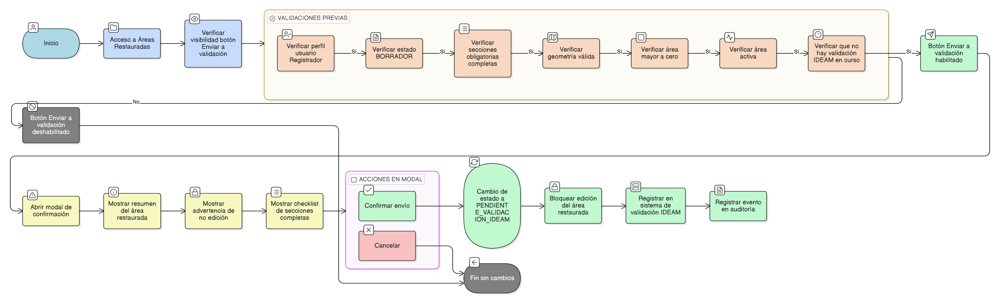

# HU-IDEAM-SNIF-REST-217

> **Identificador Historia de Usuario: hu-ideam-snif-rest-217\
> **Nombre Historia de Usuario:** Enviar área restaurada a validación IDEAM

> **Sistema de información:** Sistema Nacional de Información Forestal\
> **Módulo / subsistema:** Módulo de restauración\
> **Validador temático(s):** Raymund Alexander Jiménez Arteaga

## DESCRIPCIÓN HISTORIA DE USUARIO

> **Como:** usuario con perfil Registrador.\
> **Quiero:** enviar un área restaurada a validación oficial por parte del IDEAM.\
> **Para:** que sea revisada institucionalmente y continúe su proceso formal dentro del sistema.

## CRITERIOS DE ACEPTACIÓN

1. **Acceso a la funcionalidad**\
    1.1 Desde el tab Áreas Restauradas del proyecto, el sistema debe mostrar el botón **“Enviar a validación”** únicamente para áreas cuyo estado sea **BORRADOR**.\
    1.2 La funcionalidad debe estar disponible solo para usuarios con rol Registrador.

2. **Condiciones para habilitar el envío**\
    2.1 El botón **“Enviar a validación”** solo debe habilitarse cuando todas las secciones obligatorias del área restaurada estén completas.\
    2.2 El sistema debe validar previamente que:
    - Todas las secciones obligatorias estén completas.
    - La geometría del área sea válida.
    - El área calculada sea mayor a cero (> 0).
    - El área se encuentre activa (area_activa = TRUE).
    - El estado actual del área sea **BORRADOR**.
    - No exista un proceso de validación IDEAM en curso para el área.

3. **Modal de confirmación de envío**\
    3.1 Al hacer clic en **“Enviar a validación”**, el sistema debe abrir un modal de confirmación.\
    3.2 El modal debe mostrar un resumen del área restaurada con la siguiente información:
    - Nombre del área restaurada.
    - Superficie total (hectáreas).
    - Estado actual → **BORRADOR**.
    - Checklist de secciones completas:
    - Información general
    - Agenda política
    - Límite espacial
    - Parámetros
    - Indicadores
    - Seguimiento
    - Ecosistemas
    - Especies
    - Otras secciones que apliquen  
    
    3.3 El modal debe incluir la siguiente advertencia visible:

    > “Una vez enviada a validación, el área restaurada no podrá ser editada hasta recibir respuesta del IDEAM.”

4. **Acciones disponibles**\

    4.1 El modal debe contar con los siguientes botones:

    - Confirmar envío
    - Cancelar  

    4.2 Al seleccionar **Cancelar**, no se debe realizar ningún cambio en el estado del área restaurada.

5. **Resultado del envío**\

    5.1 Al confirmar el envío a validación:

    - El estado del área restaurada debe cambiar a **PENDIENTE_VALIDACION_IDEAM**.
    - Se debe bloquear toda opción de edición del área restaurada.
    - El área debe aparecer de forma inmediata en el sistema de validación IDEAM.
    - Se debe registrar el evento de envío a validación en el sistema de auditoría.

## ROLES

**Administrador IDEAM**: No puede realizar esta acción.
**Registrador**: Puede realizar esta acción.
**Consulta**: No puede realizar esta acción.

## RESTRICCIONES Y LÍMITES

- No se permite el envío a validación si el área restaurada no cumple todas las validaciones obligatorias.
- Una vez enviada a validación, el área queda bloqueada para edición.
- No puede existir más de un proceso de validación IDEAM en curso para una misma área restaurada.

## DIAGRAMA DE FLUJO DEL PROCESO

