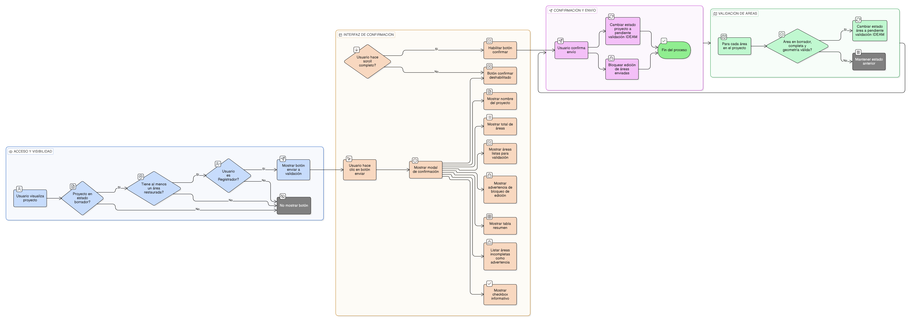

# HU-IDEAM-SNIF-REST-218

> **Identificador Historia de Usuario:** hu-ideam-snif-rest-218\
> **Nombre Historia de Usuario:** Enviar proyecto completo a validación IDEAM

> **Sistema de información:** Sistema Nacional de Información Forestal\
> **Módulo / subsistema:** Módulo de restauración\
> **Validador temático(s):** Raymund Alexander Jiménez Arteaga

## DESCRIPCIÓN HISTORIA DE USUARIO

> **Como:** usuario con perfil Registrador.\
> **Quiero:** enviar un proyecto completo a validación IDEAM.\
> **Para:** agilizar la revisión institucional y que las áreas listas sean evaluadas formalmente.

## CRITERIOS DE ACEPTACIÓN

1. **Acceso a la funcionalidad**\

    1.1 En el header del proyecto, el sistema debe mostrar el botón **“Enviar proyecto a validación”** únicamente si:

    - El proyecto está en estado **BORRADOR**.
    - Tiene al menos una área restaurada.   

    1.2 Solo usuarios con rol Registrador pueden ver y usar esta opción.

2. **Comportamiento al enviar**\

    2.1 Al hacer clic en el botón, el sistema debe abrir un modal de confirmación mostrando:
    - Nombre del proyecto.
    - Número total de áreas del proyecto.
    - Número de áreas listas para validación.
    - Advertencia visible sobre bloqueo de edición.

3. **Reglas de negocio**\
    3.1 Solo se enviarán a validación las áreas que:

    - Estén en estado **BORRADOR**.
    - Cumplan con todas las secciones obligatorias y tengan geometría válida.  

    3.2 Áreas incompletas:

    - Quedan excluidas del envío.
    - Se listan en el modal como advertencia para el usuario.   

    3.3 Al confirmar el envío:

    - El proyecto cambia de estado a **PENDIENTE_VALIDACION_IDEAM**.
    - Las áreas enviadas pasan a **PENDIENTE_VALIDACION_IDEAM**.
    - Las áreas excluidas mantienen su estado anterior. 

4. **UX esperado**\

    4.1 El modal debe mostrar:

    - Una tabla resumen con columnas:

    > **Área | Estado | ¿Se envía?**

    - Un checkbox informativo (solo lectura):

    > **“Entiendo que las áreas enviadas no podrán editarse”**

    4.2 El botón **Confirmar** envío debe permanecer deshabilitado hasta que el usuario haga scroll completo del resumen, asegurando que revisó la información.

## ROLES

- **Administrador IDEAM**: No puede realizar esta acción.
- **Registrador**: Puede realizar esta acción.
- **Consulta**: No puede realizar esta acción.

## RESTRICCIONES Y LÍMITES

- Solo se consideran para envío las áreas completas y en BORRADOR.
- Áreas incompletas no se bloquean y quedan fuera del proceso.
- Una vez enviado, las áreas incluidas y el proyecto quedan bloqueados hasta recibir respuesta del IDEAM.
- No se permite reiniciar un envío mientras exista un proceso de validación en curso para el mismo proyecto.

## DIAGRAMA DE FLUJO DEL PROCESO

