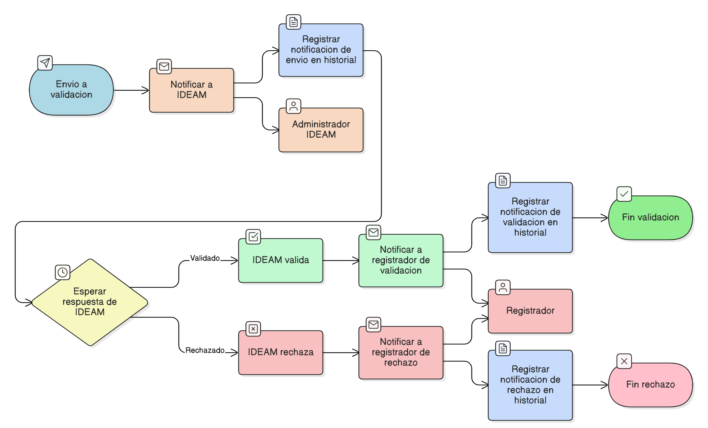

# HU-IDEAM-SNIF-REST-219

> **Identificador Historia de Usuario:** hu-ideam-snif-rest-219\
> **Nombre Historia de Usuario:** Notificaciones de envío a validación

> **Sistema de información:** Sistema Nacional de Información Forestal\
> **Módulo / subsistema:** Módulo de restauración\
> **Validador temático(s):** Raymund Alexander Jiménez Arteaga

## DESCRIPCIÓN HISTORIA DE USUARIO

> **Como:** sistema.\
> **Quiero:** enviar notificaciones al enviar un área o proyecto a validación IDEAM y al recibir respuesta.\
> **Para:** informar a los actores involucrados sobre el estado y progreso del proceso de validación.

## CRITERIOS DE ACEPTACIÓN

1. **Notificación al enviar a validación**\
    1.1 Cuando un área restaurada o proyecto completo se envíe a validación:

    - El sistema debe notificar al IDEAM (usuario o sistema receptor definido) indicando:
    - Nombre del área o proyecto.
    - Estado actual: **PENDIENTE_VALIDACION_IDEAM**.
    - Fecha y hora del envío.

2. **Notificación al validar o rechazar**\
    2.1 Cuando IDEAM valide o rechace un área o proyecto:

    - El sistema debe notificar a los usuarios involucrados (registrador del área o proyecto) indicando:
    - Nombre del área o proyecto.
    - Estado resultante: **VALIDADO** o **RECHAZADO**.
    - Fecha y hora de la acción.
    - Comentarios del IDEAM (si aplica).

3. **Reglas de negocio**\
    3.1 Las notificaciones deben generarse automáticamente por el sistema y no requerir intervención manual.\
    3.2 Cada notificación debe registrarse en el historial de auditoría del área o proyecto.\
    3.3 Se deben enviar únicamente notificaciones relacionadas con acciones de envío, validación o rechazo; no se envían notificaciones por cambios internos menores.

## ROLES

- **Sistema**: Responsable de generar y enviar notificaciones automáticas.
- **Registrador**: Recibe notificaciones de validación o rechazo.
- **Administrador IDEAM**: Recibe notificaciones de envío a validación.

## RESTRICCIONES Y LÍMITES

- No se permite envío de notificaciones duplicadas para la misma acción.
- Las notificaciones deben reflejar fielmente el estado actualizado del área o proyecto.
- El sistema debe garantizar entrega confiable a los actores definidos (registrador y IDEAM).

## DIAGRAMA DE FLUJO DEL PROCESO

