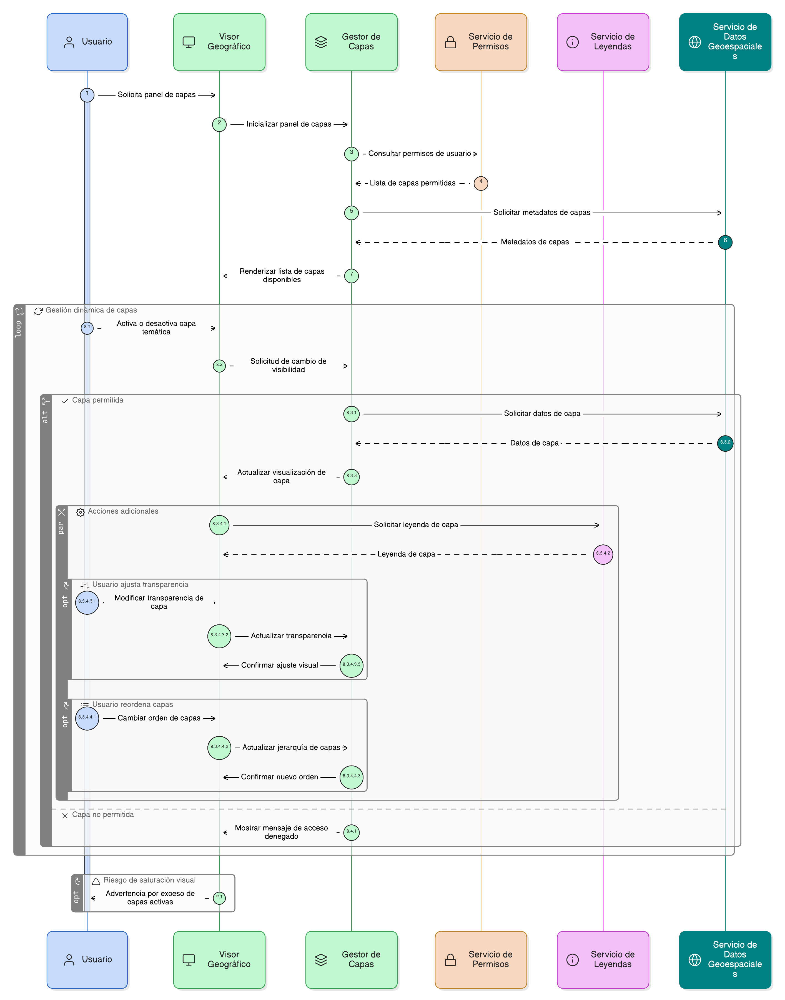

# Épica 22: Control y Gestión de Capas del Visor Geográfico

## 1. Descripción general

Esta épica define las funcionalidades necesarias para el control, visualización y gestión de capas temáticas dentro del visor geográfico del sistema, permitiendo a los usuarios interactuar de manera clara, ordenada y flexible con la información espacial disponible.

El visor geográfico constituye una herramienta transversal para la interpretación territorial de proyectos, áreas restauradas, indicadores y variables ambientales, por lo cual la correcta administración de las capas es fundamental para:

- Evitar interpretaciones erróneas de la información espacial.
- Facilitar el análisis territorial y la toma de decisiones.
- Garantizar consistencia visual entre diferentes módulos del sistema.

La gestión de capas incluye el control de visibilidad, jerarquía, agrupación temática y disponibilidad según el perfil del usuario, sin permitir modificaciones directas sobre los datos geoespaciales fuente.

## 2. Objetivo

Permitir a los usuarios del visor geográfico seleccionar, visualizar y gestionar capas temáticas de forma controlada, clara y flexible, garantizando:

- Una correcta interpretación espacial de la información.
- La visualización ordenada y jerárquica de las capas geográficas.
- La activación y desactivación dinámica de capas según necesidad.
- La diferenciación visual entre capas base y capas temáticas.
- El acceso controlado a capas según rol y permisos del usuario.
- La estabilidad y consistencia de la información geográfica presentada.

## 3. Historias de usuario asociadas

- [**HU-IDEAM-SNIF-REST-220:** Control de capas activas](EP-IDEAM-SNIF-REST-021/HU-IDEAM-SNIF-REST-220)
- [**HU-IDEAM-SNIF-REST-221:** Visualización de leyenda por capa](EP-IDEAM-SNIF-REST-022/HU-IDEAM-SNIF-REST-221)
- [**HU-IDEAM-SNIF-REST-222:** AAjuste de transparencia de capas](EP-IDEAM-SNIF-REST-022/HU-IDEAM-SNIF-REST-222)
- [**HU-IDEAM-SNIF-REST-223:** Reordenamiento de capas](EP-IDEAM-SNIF-REST-022/HU-IDEAM-SNIF-REST-223)

## 4. Riesgos

- Saturación visual del visor por exceso de capas activas.
- Interpretación incorrecta de información espacial por superposición inadecuada.
- Acceso a capas no autorizadas según el perfil del usuario.
- Problemas de rendimiento al cargar múltiples capas simultáneamente.
- Falta de claridad en la jerarquía y simbología de las capas.

## 5. Diagrama de secuencia

## 6. Wireframes / mockupso
