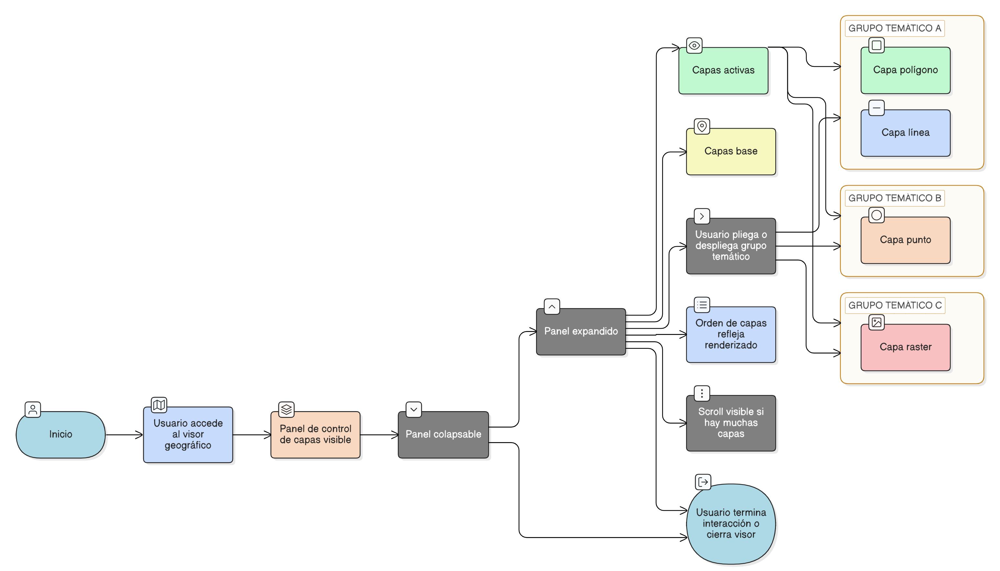

# HU-IDEAM-SNIF-REST-220

> **Identificador Historia de Usuario:** hu-ideam-snif-rest-220\
> **Nombre Historia de Usuario:** Control de capas activas

> **Sistema de información:** Sistema Nacional de Información Forestal\
> **Módulo / subsistema:** Módulo de restauración\
> **Validador temático(s):** Raymund Alexander Jiménez Arteaga

## DESCRIPCIÓN HISTORIA DE USUARIO

> **Como:** usuario del visor geográfico del módulo de restauración.\
> **Quiero:** ver un listado de las capas actualmente activas.\
> **Para:** gestionar su visualización y el orden en el mapa de forma eficiente.

## CRITERIOS DE ACEPTACIÓN

1. **Herramienta de Control de Capas**\
1.1 El visor debe incluir una herramienta de Control de Capas visible y accesible.\
1.2 El control muestra únicamente las capas que están actualmente activas.

2. **Información de cada capa**\
2.1 Cada capa activa debe mostrar:

- Nombre de la capa.
- Grupo temático al que pertenece.
- Icono que indique el tipo de capa (polígono, línea, punto, raster).                               
2.2 Las capas se deben agrupar visualmente por grupo temático para facilitar la navegación.

3. **Validaciones de negocio**\
3.1 El orden de las capas en el control debe reflejar el orden de renderizado en el mapa.\
3.2 Las capas base se gestionan en un grupo separado y no se mezclan con las capas activas del usuario.

4. **UX esperado**\
4.1 Panel de control colapsable.\
4.2 Grupos temáticos plegables y desplegables según preferencia del usuario.\
4.3 Scroll visible si hay muchas capas activas para asegurar que todas sean accesibles.

## ROLES

- **Administrador IDEAM**: Puede realizar la acción.
- **Registrador**: Puede realizar la acción.
- **Consulta**: Puede realizar la acción.

## RESTRICCIONES Y LÍMITES

- Solo se muestran las capas activas listadas en el Control de Capas.
- No se permite modificar el orden o la simbología de las capas desde el visor; el panel es solo visualización y gestión de orden de renderizado.
- Las capas base se gestionan en un grupo separado y no se pueden desactivar ni mover.
- El panel debe funcionar correctamente aunque haya muchas capas activas, sin afectar el rendimiento del visor.

## DIAGRAMA DE FLUJO DEL PROCESO

