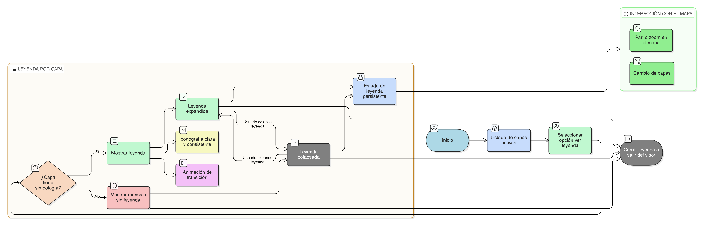

# HU-IDEAM-SNIF-REST-221

> **Identificador Historia de Usuario:** hu-ideam-snif-rest-221\
> **Nombre Historia de Usuario:** Visualización de leyenda por capa

> **Sistema de información:** Sistema Nacional de Información Forestal\
> **Módulo / subsistema:** Módulo de restauración\
> **Validador temático(s):** Raymund Alexander Jiménez Arteaga

## DESCRIPCIÓN HISTORIA DE USUARIO

> **Como:** usuario del visor geográfico del módulo de restauración.\
> **Quiero:** ver la leyenda asociada a cada capa activa.\
> **Para:**interpretar correctamente la simbología mostrada en el mapa y facilitar análisis.

## CRITERIOS DE ACEPTACIÓN

1. **Opción de ver leyenda por capa**\
    1.1 Cada capa listada en el Control de Capas debe incluir la opción “Ver leyenda”.\
    1.2 La leyenda debe mostrar claramente:

    - Símbolos usados en la capa.
    - Colores asociados.
    - Rangos o categorías aplicadas.

2. **Comportamiento de la leyenda**\
    2.1 La leyenda debe poder expandirse y colapsarse individualmente por capa sin afectar otras capas.\
    2.2 Al mover o hacer zoom en el mapa, la leyenda debe mantener su estado visible o colapsado según el usuario.

3. **Validaciones de negocio**\
    3.1 La leyenda mostrada debe corresponder exactamente a la simbología aplicada en el mapa.\
    3.2 Capas sin simbología definida deben mostrar un mensaje informativo indicando que no hay leyenda disponible.

4. **UX esperado**\
    4.1 Animación suave al expandir o colapsar la leyenda.\
    4.2 Iconografía clara, legible y consistente con los símbolos del mapa.\
    4.3 Mantener el estado de cada leyenda aunque el usuario interactúe con el mapa (pan, zoom o cambio de capas).

## ROLES

- **Administrador IDEAM**: Puede realizar la acción.
- **Registrador**: Puede realizar la acción.
- **Consulta**: Puede realizar la acción.

## RESTRICCIONES Y LÍMITES

- La leyenda solo aplica a capas activas listadas en el Control de Capas.
- No se permite modificar la simbología desde el visor; la leyenda es solo visualización.
- Capas que no tengan simbología definida no generan leyenda, solo mensaje informativo.
- La visualización de la leyenda no debe afectar el rendimiento del visor, incluso con muchas capas activas.
- El estado de expansión/collapse de la leyenda es temporal por sesión, no se guarda de manera permanente.

## DIAGRAMA DE FLUJO DEL PROCESO

