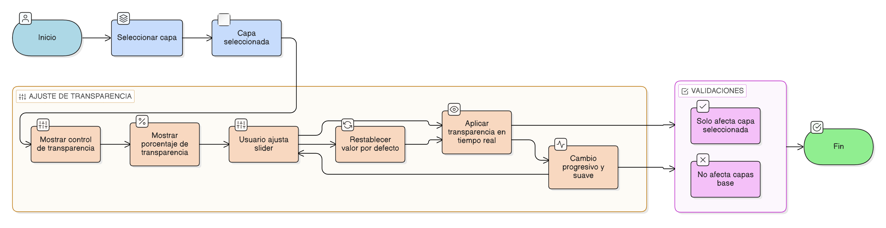

# HU-IDEAM-SNIF-REST-222

> **Identificador Historia de Usuario:** hu-ideam-snif-rest-222\
> **Nombre Historia de Usuario:** Ajuste de transparencia de capas

> **Sistema de información:** Sistema Nacional de Información Forestal\
> **Módulo / subsistema:** Módulo de restauración\
> **Validador temático(s):** Raymund Alexander Jiménez Arteaga

## DESCRIPCIÓN HISTORIA DE USUARIO

> **Como:** usuario del visor geográfico del módulo de restauración.\
> **Quiero:** modificar la transparencia de una capa.\
> **Para:** superponer información sin perder visibilidad en el mapa.

## CRITERIOS DE ACEPTACIÓN

1. **Control de transparencia**\
1.1 Cada capa activa debe tener un control de transparencia visible y accesible.\
1.2 El control permite valores entre:

- 0% → totalmente opaca.
- 100% → totalmente transparente.                      
1.3 El cambio de transparencia se refleja en tiempo real sobre la capa en el mapa.

2. **Validaciones de negocio**\
2.1 El valor de transparencia se aplica únicamente a la capa seleccionada.\
2.2 La transparencia no afecta las capas base del visor.

3. **UX esperado**\
3.1 Slider intuitivo con porcentaje visible.\
3.2 Cambio progresivo y suave de transparencia, sin parpadeos.\
3.3 Opción de restablecer valor por defecto disponible para cada capa.

## ROLES

- **Administrador IDEAM**: Puede realizar la acción.
- **Registrador**: Puede realizar la acción.
- **Consulta**: Puede realizar la acción.

## RESTRICCIONES Y LÍMITES

- La transparencia solo se aplica a capas activas, no a capas base ni capas desactivadas.
- El control de transparencia no afecta simbolización o leyendas de la capa.
- El valor de transparencia se aplica únicamente a la sesión actual del visor; no se guarda de manera permanente.
- No se permite ajustar transparencia de varias capas simultáneamente; cada capa se controla de forma individual.

## DIAGRAMA DE FLUJO DEL PROCESO

(assets/actividades-hu-ideam-snif-rest-222.png)