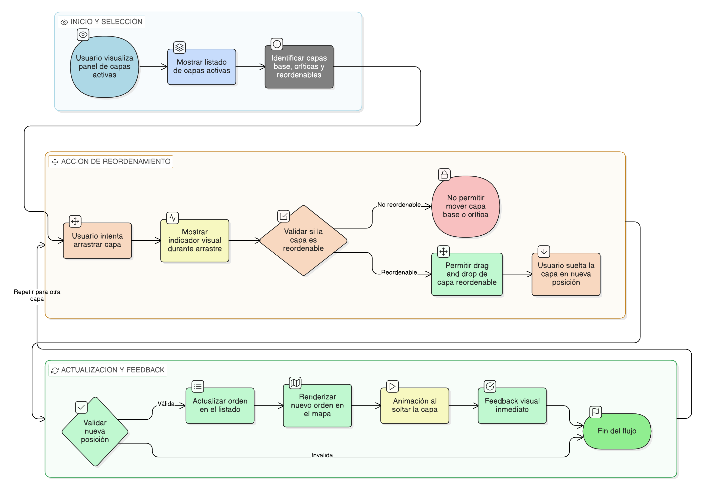

# HU-IDEAM-SNIF-REST-223

> **Identificador Historia de Usuario:** hu-ideam-snif-rest-223\
> **Nombre Historia de Usuario:** Reordenamiento de capas (orden de dibujo)

> **Sistema de información:** Sistema Nacional de Información Forestal\
> **Módulo / subsistema:** Módulo de restauración\
> **Validador temático(s):** Raymund Alexander Jiménez Arteaga

## DESCRIPCIÓN HISTORIA DE USUARIO

> **Como:** usuario del visor geográfico del módulo de restauración.\
> **Quiero:** cambiar el orden de las capas activas.\
> **Para:** controlar cuál información se visualiza por encima de otra en el mapa.

## CRITERIOS DE ACEPTACIÓN

2. **Reordenamiento de capas**\
    1.1 Las capas activas pueden reordenarse mediante drag & drop en el panel de control de capas.\
    1.2 El orden en el listado define el orden de renderizado en el mapa.\
    1.3 El cambio de orden se aplica inmediatamente al mapa.

1. **Validaciones de negocio**\
    2.1 Las capas base permanecen siempre en el fondo y no se pueden mover.\
    2.2 Capas críticas (por ejemplo, límites administrativos) pueden tener orden fijo y no son reordenables.\
    2.3 Solo se puede reordenar una capa a la vez; cada movimiento es independiente.

3. **UX esperado**\
    3.1 Indicador visual claro durante el arrastre de la capa.\
    3.2 Animación suave al soltar la capa en la nueva posición.\
    3.3 Feedback inmediato del nuevo orden reflejado en el mapa y en el listado.

## ROLES

- **Administrador IDEAM**: Puede realizar la acción.
- **Registrador**: Puede realizar la acción.
- **Consulta**: Puede realizar la acción.

## RESTRICCIONES Y LÍMITES

- El reordenamiento aplica únicamente a capas activas, no a capas base ni capas desactivadas.
- Capas críticas con orden fijo no pueden moverse.
- El cambio de orden es temporal en la sesión, a menos que exista funcionalidad adicional para guardar la configuración.
- No se permite reordenar varias capas simultáneamente; cada capa se mueve individualmente.
El reordenamiento no afecta la simbología ni la leyenda de las capas.

## DIAGRAMA DE FLUJO DEL PROCESO

