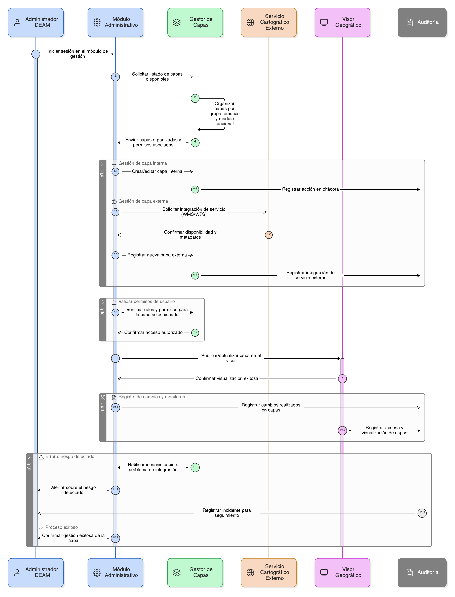

# ÉPICA 23: Gestión de Capas Geográficas

## 1. Descripción general

Esta épica define la administración integral de las capas geográficas utilizadas en el visor del sistema, permitiendo la gestión controlada de capas internas y externas, su organización temática, su asociación a módulos funcionales y el control de su disponibilidad conforme a los permisos de usuario y las condiciones de uso establecidas.

La gestión de las capas geográficas es responsabilidad exclusiva del Administrador IDEAM, con el fin de garantizar la integridad, confiabilidad y trazabilidad de la información espacial publicada en el sistema.

Esta épica soporta de manera transversal los procesos de análisis territorial, seguimiento, monitoreo y generación de reportes oficiales, asegurando una correcta interpretación espacial de la información.

2. Objetivo

Disponer de un módulo administrativo que permita la gestión centralizada, segura y auditada de las capas geográficas, garantizando:

- La correcta administración de capas internas y externas.
- La integración controlada de servicios cartográficos de terceros (WMS/WFS).
- La organización temática y funcional de las capas.
- El control de visibilidad según roles y permisos.
- La trazabilidad histórica de los cambios realizados.
- La estabilidad y coherencia de la información espacial visualizada en el visor geográfico.

## 3. Historias de usuario asociadas

- [**HU-IDEAM-SNIF-REST-224:** Gestión de Capas Externas](/historias_usuario/EP-IDEAM-SNIF-REST-023/HU-IDEAM-SNIF-REST-224)
- [**HU-IDEAM-SNIF-REST-225:** Gestión de Capas Internas](/historias_usuario/EP-IDEAM-SNIF-REST-023/HU-IDEAM-SNIF-REST-225)
- [**HU-IDEAM-SNIF-REST-226:** Organización por Grupos Temáticos](/historias_usuario/EP-IDEAM-SNIF-REST-023/HU-IDEAM-SNIF-REST-226)
- [**HU-IDEAM-SNIF-REST-227:** Gestión de Módulos](/historias_usuario/EP-IDEAM-SNIF-REST-023/HU-IDEAM-SNIF-REST-227)

## 4. Riesgos

- Publicación de capas con información inconsistente o desactualizada.
- Integración de servicios externos no confiables o inestables.
- Saturación visual del visor por mala organización de capas.
- Acceso no autorizado a información geográfica sensible.
- Pérdida de trazabilidad en los cambios realizados.
- Problemas de rendimiento por consumo ineficiente de servicios geográficos.

## 5. Diagrama de secuencia

## 6. Wireframes / mockupso

