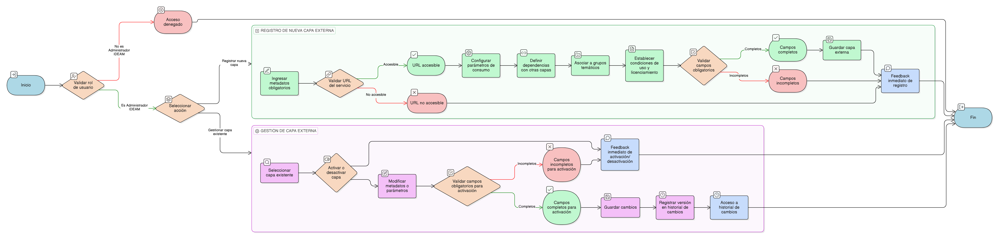

# HU-IDEAM-SNIF-REST-224

> **Identificador Historia de Usuario:** hu-ideam-snif-rest-224\
> **Nombre Historia de Usuario:** Gestión de Capas Externas

> **Sistema de información:** Sistema Nacional de Información Forestal\
> **Módulo / subsistema:** Módulo de restauración\
> **Validador temático(s):** Raymund Alexander Jiménez Arteaga

## DESCRIPCIÓN HISTORIA DE USUARIO

> **Como:** administrador del sistema.\
> **Quiero:** crear y gestionar capas externas (WMS/WFS).\
> **Para:** integrar servicios cartográficos de terceros en el visor geográfico.

## CRITERIOS DE ACEPTACIÓN

1. **Registro de nueva capa externa**\
    1.1 El sistema permite registrar una nueva capa externa con todos sus metadatos obligatorios:

    - Nombre
    - Etiqueta
    - URL de imagen (url_img)
    - URL del servicio (url_servicio)
    - Tipo de capa (punto, línea, polígono, raster)
    - Grupo asociado   
      
    1.2 Se debe validar que la URL del servicio sea accesible antes de guardar la capa.\
    1.3 Permitir configurar parámetros de consumo: método de petición (GET/POST), formato de respuesta, etc.\
    1.4 Permitir definir dependencias con otras capas, si aplica.\
    1.5 Permitir asociar la capa a uno o varios grupos temáticos.\
    1.6 Permitir establecer condiciones de uso y licenciamiento de la capa.

2. **Gestión de capa externa**\
    2.1 Se puede activar o desactivar la capa sin eliminarla del sistema.\
    2.2 Se debe mantener un historial de cambios (versionamiento) de cada capa.

3. **Validaciones de negocio**\
    3.1 Solo el Administrador IDEAM puede crear, modificar o eliminar capas externas.\
    3.2 Las capas externas deben cumplir con los campos obligatorios para ser activadas.\
    3.3 Los parámetros de consumo deben ser correctos para garantizar que el servicio externo se integre adecuadamente.

4. **UX esperado**\
    4.1 Formulario de registro intuitivo y validación en tiempo real de campos obligatorios.\
    4.2 Feedback inmediato al activar/desactivar capas.\
    4.3 Acceso al historial de cambios con versión, fecha y usuario que realizó la modificación.

## ROLES

- **Administrador IDEAM**: Puede realizar la acción.
- **Registrador**: No puede realizar la acción.
- **Consulta**: No puede realizar la acción.

## RESTRICCIONES Y LÍMITES

- No se permite registrar capas externas sin los campos obligatorios completos.
- La capa externa no puede activarse si el servicio WMS/WFS no responde correctamente.
- Solo se pueden asociar capas externas a grupos temáticos existentes.
- Los cambios en la capa deben quedar registrados en el historial de auditoría para trazabilidad.
- No se permite eliminar una capa externa mientras esté en uso por algún proyecto o área activa en el visor.

## DIAGRAMA DE FLUJO DEL PROCESO

