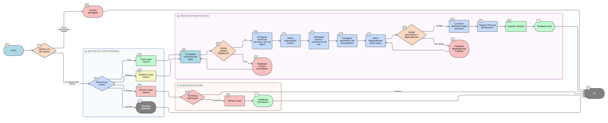

# HU-IDEAM-SNIF-REST-225

> **Identificador Historia de Usuario:** hu-ideam-snif-225\
> **Nombre Historia de Usuario:** Gestión de Capas Internas

> **Sistema de información:** Sistema Nacional de Información Forestal\
> **Módulo / subsistema:** Módulo de restauración\
> **Validador temático(s):** Raymund Alexander Jiménez Arteaga

## DESCRIPCIÓN HISTORIA DE USUARIO

> **Como:** administrador del sistema.\
> **Quiero:** administrar capas internas alojadas en el servidor.\
> **Para:** publicar información geográfica propia del SNIF y asegurar su disponibilidad en el visor geográfico.

## CRITERIOS DE ACEPTACIÓN

1. **Creación y configuración de capa interna**\
    1.1 Permitir crear una nueva capa interna vinculada a un módulo específico.\
    1.2 Configurar la fuente de servicio y el tipo de datos de la capa.\
    1.3 Definir el responsable interno de la capa.\
    1.4 Establecer el estado actual de la capa y condiciones de uso.\
    1.5 Configurar parámetros de actualización de la capa.\
    1.6 Permitir definir dependencias entre capas internas.\
    1.7 Controlar la visibilidad de la capa según permisos de usuario.\
    1.8 Asignar filtros de actualización específicos según necesidades del módulo.

2. **Validaciones de negocio**\
    2.1 Solo el Administrador IDEAM puede crear, modificar o eliminar capas internas.\
    2.2 Los campos obligatorios deben estar completos para que la capa pueda activarse:

    - Nombre
    - Etiqueta
    - Tipo
    - Módulo
    - Fuente de servicio   
     
    2.3 La capa interna debe cumplir los parámetros de actualización y dependencias para garantizar consistencia con otras capas.

3. **UX esperado**\
    3.1 Formulario de registro y edición intuitivo con validación en tiempo real de campos obligatorios.\
    3.2 Feedback inmediato al activar/desactivar capas o cambiar su visibilidad.\
    3.3 Visualización clara de las dependencias y filtros aplicados.

## ROLES

- **Administrador IDEAM**: Puede realizar la acción.
- **Registrador**: No puede realizar la acción.
- **Consulta**: No puede realizar la acción.

## RESTRICCIONES Y LÍMITES

- No se permite crear o activar capas internas sin los campos obligatorios completos.
- La visibilidad y actualización de la capa se debe controlar estrictamente según los permisos del usuario.
- La capa interna debe estar asociada a un módulo existente.
- No se permite eliminar una capa interna mientras esté en uso por algún proyecto o área activa en el visor.
- Los cambios deben quedar registrados en el historial de auditoría para trazabilidad.

## DIAGRAMA DE FLUJO DEL PROCESO

