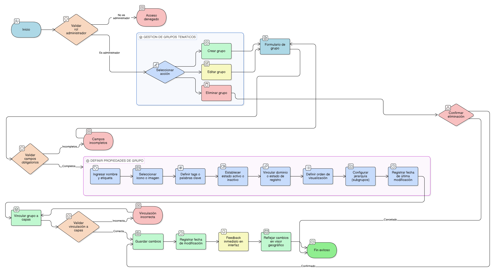

# HU-IDEAM-SNIF-REST-226

> **Identificador Historia de Usuario:** hu-ideam-snif-rest-226\
> **Nombre Historia de Usuario:** Organización por Grupos Temáticos

> **Sistema de información:** Sistema Nacional de Información Forestal\
> **Módulo / subsistema:** Módulo de restauración\
> **Validador temático(s):** Raymund Alexander Jiménez Arteaga

## DESCRIPCIÓN HISTORIA DE USUARIO

> **Como:** administrador del sistema.\
> **Quiero:** organizar las capas en grupos temáticos.\
> **Para:** facilitar la navegación y búsqueda de información en el visor geográfico.

## CRITERIOS DE ACEPTACIÓN

1. **Creación y configuración de grupos**\
1.1 Permitir crear grupos con nombre descriptivo y etiqueta (label).\
1.2 Asignar un icono o imagen representativa para cada grupo.\
1.3 Definir tags o palabras clave para mejorar la búsqueda de capas dentro del grupo.\
1.4 Establecer el estado activo del grupo.\
1.5 Vincular el grupo al dominio o estado de registro correspondiente.\
1.6 Definir el orden de visualización de los grupos en el visor.\
1.7 Permitir grupos jerárquicos (subgrupos).\
1.8 Registrar la fecha de última modificación para auditoría.

2. **Validaciones de negocio**\
2.1 Solo el Administrador IDEAM puede crear, editar o eliminar grupos temáticos.\
2.2 Los campos obligatorios deben completarse para que el grupo se pueda activar:

Nombre (label)

Activo

Fecha de creación (fch_creacion)

2.3 El grupo debe estar correctamente vinculado a las capas asociadas para garantizar visibilidad y jerarquía correcta.

3. **UX esperado**\
3.1 Formulario de creación y edición claro, con validación en tiempo real de campos obligatorios.\
3.2 Vista de lista de grupos con íconos y jerarquía visual (subgrupos).\
3.3 Feedback inmediato al activar/desactivar grupos o cambiar su orden.\
3.4 Búsqueda rápida por tags/palabras clave.

## ROLES

**Administrador IDEAM**: Puede realizar la acción.
**Registrador**: No puede realizar la acción.
**Consulta**: No puede realizar la acción.

## RESTRICCIONES Y LÍMITES

- No se permite activar un grupo sin completar los campos obligatorios.
- El nombre del grupo debe ser único dentro del módulo.
- La jerarquía de subgrupos no puede generar ciclos (un grupo no puede ser subgrupo de sí mismo).
- Los cambios deben registrarse en el historial de auditoría para trazabilidad.
- El listado de grupos está limitado al conjunto definido y aprobado por SNIF, incluyendo por ejemplo: Amenaza, Áreas protegidas y estrategias complementarias, Atmósfera, Biodiversidad, Cambio climático, Clima, Cobertura de la tierra, Económico, Ecosistemas, Ecosistemas estratégicos, Fauna y Flora, Geología, Geomorfología, Gestión del riesgo, Hidrogeología, Hidrología, Infraestructura, Movimiento en masa, Sociocultural, Socioeconómico, Suelos, Zonificación.

## DIAGRAMA DE FLUJO DEL PROCESO

(assets/actividades-hu-ideam-snif-rest-226.png)