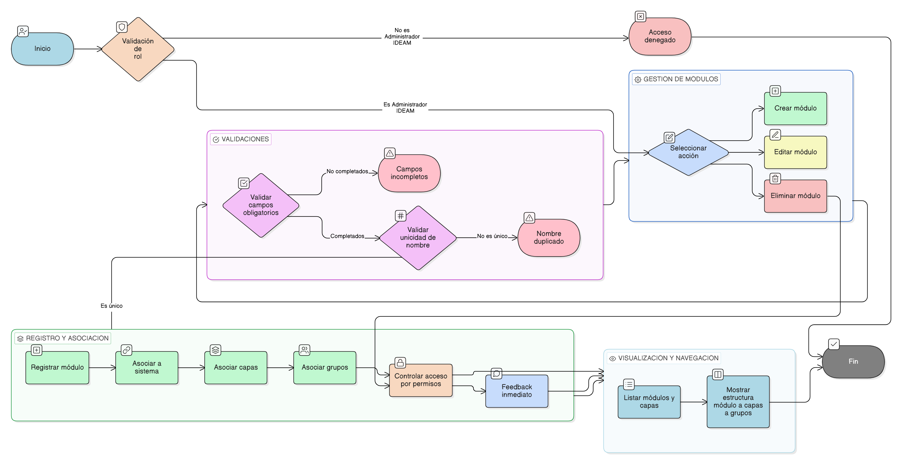

# HU-IDEAM-SNIF-REST-227

> **Identificador Historia de Usuario:** hu-ideam-snif-rest-227\
> **Nombre Historia de Usuario:** Gestión de Módulos

> **Sistema de información:** Sistema Nacional de Información Forestal\
> **Módulo / subsistema:** Módulo de restauración\
> **Validador temático(s):** Raymund Alexander Jiménez Arteaga

## DESCRIPCIÓN HISTORIA DE USUARIO

> **Como:** administrador del sistema.\
> **Quiero:** administrar los módulos del sistema.\
> **Para:** organizar las capas internas por funcionalidad y mantener la estructura del sistema clara.

## CRITERIOS DE ACEPTACIÓN

1. **Creación y configuración de módulos**\
    1.1 Permitir registrar módulos con nombre único dentro del sistema.\
    1.2 Asociar cada módulo a sistemas específicos mediante fk_sistema.\
    1.3 Listar las capas internas asociadas a cada módulo.\
    1.4 Controlar el acceso a los módulos según permisos de usuario.\
    1.5 Visualizar la relación módulo → capas → grupos, para facilitar la navegación y auditoría.

2. **Validaciones de negocio**\
    2.1 Solo el Administrador IDEAM puede crear, modificar o eliminar módulos.\
    2.2 Los campos obligatorios deben completarse para que el módulo pueda activarse:
    - Nombre
    - fk_sistema   
                                    
    2.3 No se pueden registrar dos módulos con el mismo nombre dentro del mismo sistema.

3 **UX esperado**\
    3.1 Formulario de creación y edición intuitivo, con validación en tiempo real de campos obligatorios.\
    3.2 Listado claro de módulos con las capas internas asociadas y grupos temáticos vinculados.\
    3.3 Feedback inmediato al asociar o desvincular capas de un módulo.

## ROLES

- **Administrador IDEAM**: Puede realizar la acción.
- **Registrador**: No puede realizar la acción.
- **Consulta**: No puede realizar la acción.

## RESTRICCIONES Y LÍMITES

- No se permite crear módulos sin los campos obligatorios completos.
- El nombre del módulo debe ser único dentro del sistema asociado.
- No se puede eliminar un módulo que tenga capas internas activas asociadas.
- Los cambios deben registrarse en el historial de auditoría para trazabilidad.
- El acceso a los módulos se controla estrictamente por permisos de usuario; los módulos solo visibles a usuarios autorizados.

## DIAGRAMA DE FLUJO DEL PROCESO

