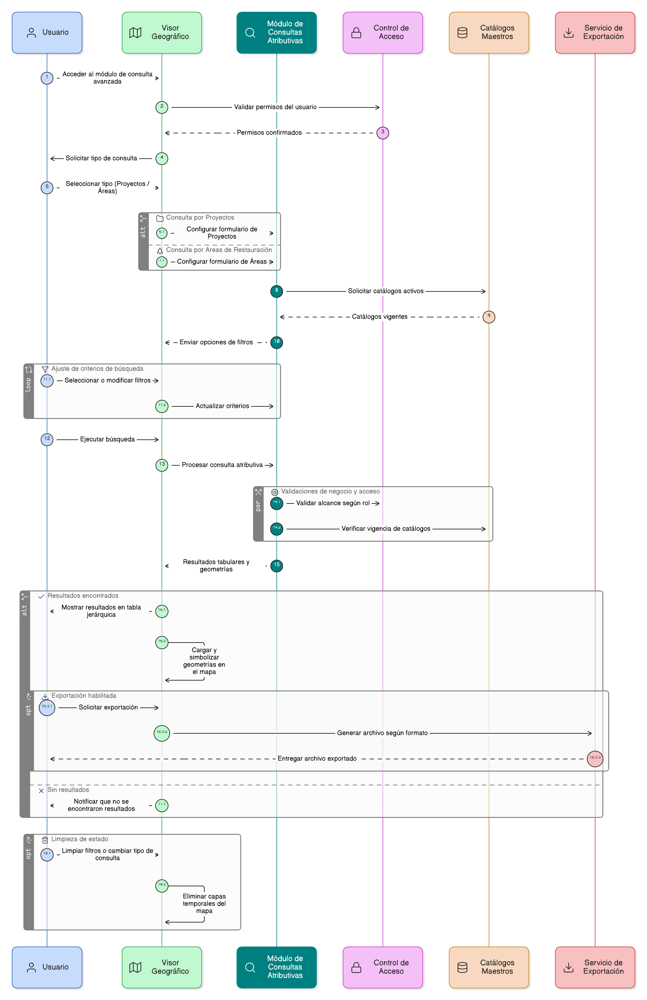

# Épica 024: Consulta Atributiva y Búsqueda Avanzada de Proyectos y Áreas de Restauración

## 1. Descripción general

Esta épica define la consulta atributiva avanzada y la búsqueda estructurada de proyectos y áreas de restauración dentro del visor del módulo de restauración del SNIF, permitiendo a los usuarios combinar criterios temáticos, administrativos y espaciales para localizar, analizar y visualizar información registrada en el sistema.

La funcionalidad permite seleccionar dinámicamente el tipo de consulta (proyectos o áreas de restauración), adaptar los criterios de búsqueda según el contexto, y presentar los resultados de forma tabular, jerárquica y geográfica, garantizando consistencia entre datos, tabla y visor cartográfico.

La épica garantiza:

- Búsquedas avanzadas basadas en catálogos maestros activos.
- Control de acceso según rol y nivel de permisos.
- Consistencia entre resultados tabulares y visualización geográfica.
- Integración directa con el visor geográfico del SNIF.
- Exportación controlada de resultados según perfil de usuario.

## 2. Objetivo

Permitir a los usuarios del visor del módulo de restauración del SNIF realizar consultas atributivas avanzadas sobre proyectos y áreas de restauración, con el fin de:

- Localizar proyectos y áreas mediante múltiples criterios combinados.
- Analizar información de forma tabular, jerárquica y geográfica.
- Facilitar el acceso a información validada según el perfil del usuario.
- Integrar los resultados de consulta con el visor geográfico.
- Habilitar la exportación controlada de resultados para análisis externo.

## 3. Historias de usuario asociadas

- [**HU-IDEAM-SNIF-REST-228:** Selección del tipo de consulta: Proyectos o Áreas de Restauración](EP-IDEAM-SNIF-REST-024/HU-IDEAM-SNIF-REST-228.md)
- [**HU-IDEAM-SNIF-REST-229:** Consulta atributiva avanzada por Proyectos](EP-IDEAM-SNIF-REST-024/HU-IDEAM-SNIF-REST-229.md)
- [**HU-IDEAM-SNIF-REST-230:** Visualización de resultados de consulta por Proyectos](EP-IDEAM-SNIF-REST-024/HU-IDEAM-SNIF-REST-230.md)
- [**HU-IDEAM-SNIF-REST-231:** Ordenamiento y paginación de resultados](EP-IDEAM-SNIF-REST-024/HU-IDEAM-SNIF-REST-231.md)
- [**HU-IDEAM-SNIF-REST-232:** Exportación de resultados de consulta por Proyectos](EP-IDEAM-SNIF-REST-024/HU-IDEAM-SNIF-REST-232.md)
- [**HU-IDEAM-SNIF-REST-233:** Consulta atributiva avanzada por Áreas de Restauración](EP-IDEAM-SNIF-REST-024/HU-IDEAM-SNIF-REST-233.md)
- [**HU-IDEAM-SNIF-REST-234:** Visualización de resultados de consulta por Áreas de Restauración](EP-IDEAM-SNIF-REST-024/HU-IDEAM-SNIF-REST-234.md)
- [**HU-IDEAM-SNIF-REST-235:** Integración de la consulta atributiva con el visor geográfico](EP-IDEAM-SNIF-REST-024/HU-IDEAM-SNIF-REST-235.md)

## 4. Riesgos

- Ejecución de consultas sin criterios mínimos que afecten el rendimiento del sistema.
- Inconsistencias entre los resultados tabulares y la visualización en el mapa.
- Uso de catálogos maestros inactivos o desactualizados en filtros de búsqueda.
- Acceso no autorizado a información sensible por usuarios invitados.
- Exportaciones masivas que afecten la estabilidad del sistema.
- Pérdida de sincronización entre filtros aplicados y capas temporales del visor.
- Persistencia indebida de capas de resultados en el visor geográfico.

## 5. Diagrama de secuencia

## 6. Wireframes / mockups
