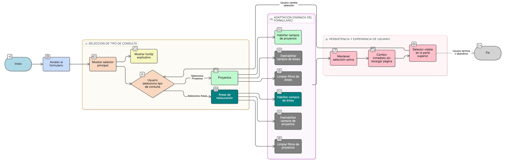

# HU-IDEAM-SNIF-REST-228

> **Identificador Historia de Usuario:** hu-ideam-snif-rest-228\
> **Nombre Historia de Usuario:** Selección del tipo de consulta: Proyectos o Áreas de Restauración

> **Sistema de información:** Sistema Nacional de Información Forestal\
> **Módulo / subsistema:** Módulo de restauración\
> **Validador temático(s):** Raymond Alexander Jiménez Arteaga

## DESCRIPCIÓN HISTORIA DE USUARIO

> **Como:** usuario del visor.\
> **Quiero:** elegir si la consulta se realizará sobre proyectos o sobre áreas de restauración.\
> **Para:** adaptar dinámicamente los criterios de búsqueda al tipo de información requerida.

## CRITERIOS DE ACEPTACIÓN

1. **Selector principal de tipo de consulta**\
   1.1 El formulario de consulta debe presentar un selector principal que permita elegir entre:
   - Proyectos
   - Áreas de restauración

2. **Comportamiento dinámico del formulario**\
   2.1 Al cambiar el tipo de consulta seleccionado:
   - Se deben habilitar o deshabilitar dinámicamente los campos correspondientes al tipo elegido.
   - Se deben limpiar automáticamente los filtros que no apliquen al nuevo tipo de consulta.

3. **Persistencia de la selección**\
   3.1 El tipo de consulta seleccionado debe mantenerse activo hasta que el usuario decida cambiarlo nuevamente.

4. **Experiencia de usuario (UX)**\
   4.1 El selector de tipo de consulta debe ser visible en la parte superior del formulario.\
   4.2 El cambio de tipo de consulta debe realizarse de forma inmediata, sin recargar la página.\
   4.3 El selector debe contar con un tooltip explicativo que describa el alcance de cada tipo de consulta.

## ROLES

- **Administrador IDEAM**: Puede realizar la acción.
- **Registrador**: Puede realizar la action.
- **Consulta**: Puede realizar la acción.

## RESTRICCIONES Y LÍMITES

- El selector define exclusivamente el tipo de consulta y no ejecuta búsquedas por sí mismo.
- No se deben permitir combinaciones simultáneas de criterios entre proyectos y áreas de restauración.
- Los filtros no aplicables deben limpiarse automáticamente al cambiar el tipo de consulta.

## DIAGRAMA DE FLUJO DEL PROCESO

