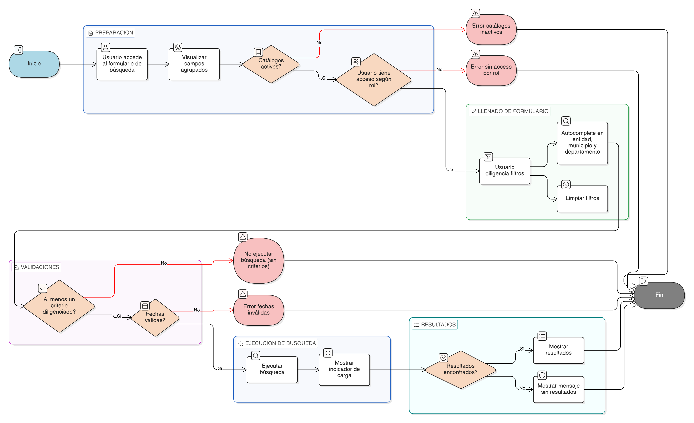

# HU-IDEAM-SNIF-REST-229

> **Identificador Historia de Usuario:** hu-ideam-snif-rest-229\
> **Nombre Historia de Usuario:** Consulta atributiva avanzada por Proyectos

> **Sistema de información:** Sistema Nacional de Información Forestal\
> **Módulo / subsistema:** Módulo de restauración\
> **Validador temático(s):** Raymond Alexander Jiménez Arteaga

## DESCRIPCIÓN HISTORIA DE USUARIO

> **Como:** usuario del visor.\
> **Quiero:** buscar proyectos de restauración usando múltiples criterios atributivos.\
> **Para:** localizar proyectos específicos o conjuntos de proyectos de interés.

## CRITERIOS DE ACEPTACIÓN

1. **Formulario de búsqueda por Proyectos**\
   1.1 El formulario de búsqueda por **Proyectos** debe permitir filtrar por:
   - Identificador del proyecto.
   - Entidad ejecutora.
   - Rango de fecha de creación (desde / hasta).
   - Tipo de proyecto.
   - Tipo de trámite.
   - Tipo de acto administrativo.
   - Fuente de financiamiento.
   - Unidades espaciales de referencia:
     - Departamento.
     - Municipio.
     - Otras divisiones administrativas habilitadas.

    1.2 El formulario debe disponer de los siguientes botones:

   - Buscar.
   - Limpiar filtros.

2. **Validaciones de negocio**\
   2.1 La fecha **desde** no puede ser mayor que la fecha **hasta**.\
   2.2 Al menos un criterio debe estar diligenciado para ejecutar la búsqueda.\
   2.3 Los valores de las listas desplegables deben provenir de catálogos maestros activos.\
   2.4 El usuario solo puede consultar proyectos según su nivel de acceso:
   - Invitado: solo proyectos validados.
   - Registrador: proyectos de su entidad.
   - Administrador del sistema: todos los proyectos.\
    
   2.5 No se debe ejecutar una consulta vacía.\
     2.6 Los catálogos maestros deben encontrarse activos.

3. **Experiencia de usuario (UX)**\
   3.1 Los campos deben estar agrupados por secciones:
   - Administrativos.
   - Temporales.
   - Espaciales.
   
   3.2 Los campos de entidad, municipio y departamento deben contar con funcionalidad de autocomplete.\
     3.3 El sistema debe mostrar un indicador visual de carga al ejecutar la búsqueda.\
     3.4 El sistema debe mostrar un mensaje claro cuando no se encuentren resultados.

## ROLES

- **Administrador IDEAM**: Puede realizar la acción.
- **Registrador**: Puede realizar la acción.
- **Consulta**: Puede realizar la acción.

## RESTRICCIONES Y LÍMITES

- La búsqueda se ejecuta únicamente cuando se diligencie al menos un criterio.
- Los resultados dependen del alcance definido por el rol del usuario.
- Los filtros disponibles dependen de catálogos maestros activos.

## DIAGRAMA DE FLUJO DEL PROCESO

