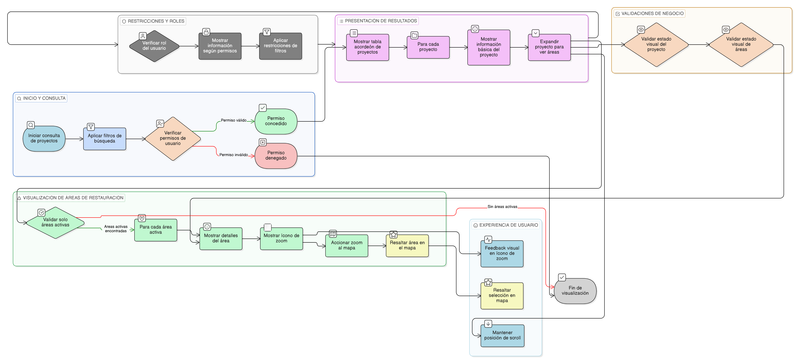

# HU-IDEAM-SNIF-REST-230

> **Identificador Historia de Usuario:** hu-ideam-snif-rest-230\
> **Nombre Historia de Usuario:** Visualización de resultados de consulta por Proyectos

> **Sistema de información:** Sistema Nacional de Información Forestal\
> **Módulo / subsistema:** Módulo de restauración\
> **Validador temático(s):** Raymond Alexander Jiménez Arteaga

## DESCRIPCIÓN HISTORIA DE USUARIO

> **Como:** usuario del visor.\
> **Quiero:** ver los resultados de la búsqueda de proyectos en una tabla jerárquica.\
> **Para:** analizar su información general y acceder a sus áreas de restauración.

## CRITERIOS DE ACEPTACIÓN

1. **Presentación de resultados**\
   1.1 Los resultados de la consulta deben mostrarse en una tabla tipo acordeón.\
   1.2 Cada fila principal debe representar un proyecto e incluir como mínimo:
   - Identificador.
   - Nombre.
   - Entidad.
   - Tipo de proyecto.
   - Estado de validación IDEAM.
   - Fecha de creación.
   - Área total restaurada (si aplica).

2. **Visualización de áreas de restauración asociadas**\
   2.1 Cada proyecto debe poder expandirse para mostrar el listado de áreas de restauración asociadas.\
   2.2 Por cada área de restauración se debe mostrar como mínimo:
   - Nombre / descripción.
   - Superficie (ha).
   - Estado.
   - Ícono de acercar al mapa (zoom).

3. **Validaciones de negocio**\
   3.1 Solo se deben listar áreas de restauración activas.\
   3.2 La acción de zoom al mapa debe centrar y resaltar la geometría del área seleccionada.\
   3.3 El estado visual del proyecto y de sus áreas debe ser consistente con su estado de validación.

4. **Experiencia de usuario (UX)**\
   4.1 Los acordeones deben ser expandibles sin perder la posición del scroll.\
   4.2 El proyecto o área seleccionada debe resaltarse visualmente en el mapa.\
   4.3 El ícono de zoom debe presentar feedback visual al hacer clic.

## ROLES

- **Administrador IDEAM**: Puede realizar la acción.
- **Registrador**: Puede realizar la acción.
- **Consulta**: Puede realizar la acción.

## RESTRICCIONES Y LÍMITES

- Los resultados mostrados dependen de los filtros aplicados en la consulta.
- Solo se visualiza información acorde al rol y permisos del usuario.
- El visor geográfico se utiliza únicamente como apoyo visual para la navegación de resultados.

## DIAGRAMA DE FLUJO DEL PROCESO

