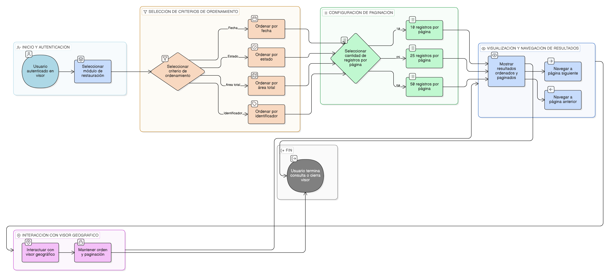

# HU-IDEAM-SNIF-REST-231

> **Identificador Historia de Usuario:** hu-ideam-snif-rest-231\
> **Nombre Historia de Usuario:** Ordenamiento y paginación de resultados

> **Sistema de información:** Sistema Nacional de Información Forestal\
> **Módulo / subsistema:** Módulo de restauración\
> **Validador temático(s):** Raymond Alexander Jiménez Arteaga

## DESCRIPCIÓN HISTORIA DE USUARIO

> **Como:** usuario del visor.\
> **Quiero:** ordenar y paginar los resultados de consulta.\
> **Para:** analizar grandes volúmenes de información de forma eficiente.

## CRITERIOS DE ACEPTACIÓN

1. **Ordenamiento de resultados**\
   1.1 El sistema debe permitir el ordenamiento de los resultados de consulta por los siguientes criterios:
   - Fecha.
   - Estado.
   - Área total.
   - Identificador.

2. **Paginación de resultados**\
   2.1 El sistema debe permitir configurar la cantidad de registros por página.\
   2.2 Las opciones de paginación deben incluir valores configurables, por ejemplo:
   - 10 registros.
   - 25 registros.
   - 50 registros.

3. **Reglas de comportamiento**\
   3.1 El ordenamiento aplicado no debe modificar la consulta original ejecutada.\
   3.2 El estado del orden seleccionado debe mantenerse al interactuar con el mapa.

## ROLES

- **Administrador IDEAM**: Puede realizar la acción.
- **Registrador**: Puede realizar la acción.
- **Consulta**: Puede realizar la acción.

## RESTRICCIONES Y LÍMITES

- El ordenamiento y la paginación se aplican únicamente sobre los resultados ya consultados.
- La interacción con el visor geográfico no debe alterar el orden ni la paginación seleccionados.

## DIAGRAMA DE FLUJO DEL PROCESO

