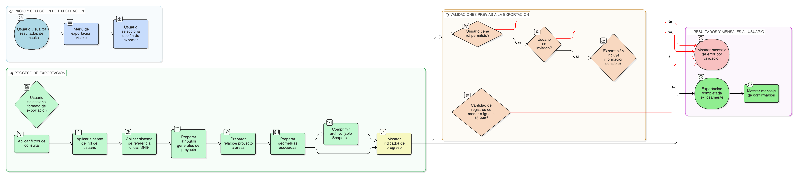

# HU-IDEAM-SNIF-REST-232

> **Identificador Historia de Usuario:** hu-ideam-snif-rest-232\
> **Nombre Historia de Usuario:** Exportación de resultados de consulta por Proyectos

> **Sistema de información:** Sistema Nacional de Información Forestal\
> **Módulo / subsistema:** Módulo de restauración\
> **Validador temático(s):** Raymond Alexander Jiménez Arteaga

## DESCRIPCIÓN HISTORIA DE USUARIO

> **Como:** usuario del visor.\
> **Quiero:** exportar los resultados de la búsqueda.\
> **Para:** analizarlos o compartirlos fuera del sistema.

## CRITERIOS DE ACEPTACIÓN

1. **Formatos de exportación**\
   1.1 El formulario de resultados debe permitir la exportación de la información en los siguientes formatos:
   - KML.
   - Shapefile.
   - GeoJSON.
   - Excel.

2. **Condiciones de la exportación**\
   2.1 La exportación debe respetar:
   - Los filtros aplicados en la consulta.
   - El alcance definido por el rol del usuario.
   
   2.2 La información exportada debe utilizar el sistema de referencia oficial del SNIF.
     2.3 El archivo exportado debe incluir:
   - Atributos generales del proyecto.
   - Relación proyecto → áreas.
   - Geometrías asociadas, cuando aplique.

3. **Validaciones de negocio**\
   3.1 Los usuarios invitados no pueden exportar información sensible.\
   3.2 El sistema debe limitar exportaciones de gran volumen, por ejemplo, mayores a 10.000 registros.\
   3.3 El formato Shapefile debe entregarse como un archivo comprimido.

4. **Experiencia de usuario (UX)**\
   4.1 El menú de exportación debe ser visible sobre la tabla de resultados.\
   4.2 El sistema debe mostrar un indicador de progreso durante la generación del archivo.\
   4.3 Al finalizar la exportación, el sistema debe mostrar un mensaje de confirmación.

## ROLES

- **Administrador IDEAM**: Puede realizar la acción.
- **Registrador**: Puede realizar la acción.
- **Consulta**: Puede realizar la acción.

## RESTRICCIONES Y LÍMITES

- La exportación solo incluye información acorde al alcance del rol del usuario.
- El volumen de información exportada está sujeto a límites definidos por el sistema.
- La exportación se realiza únicamente sobre los resultados obtenidos en la consulta actual.

## DIAGRAMA DE FLUJO DEL PROCESO

