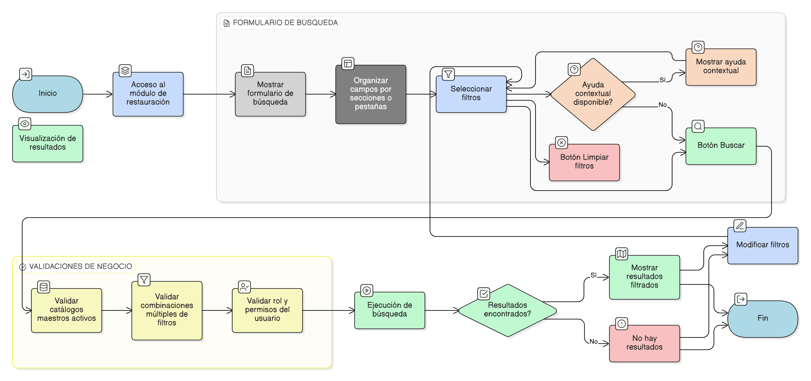

# HU-IDEAM-SNIF-REST-233

> **Identificador Historia de Usuario:** hu-ideam-snif-rest-233\
> **Nombre Historia de Usuario:** Consulta atributiva avanzada por Áreas de Restauración

> **Sistema de información:** Sistema Nacional de Información Forestal\
> **Módulo / subsistema:** Módulo de restauración\
> **Validador temático(s):** Raymond Alexander Jiménez Arteaga

## DESCRIPCIÓN HISTORIA DE USUARIO

> **Como:** usuario del visor.\
> **Quiero:** buscar áreas de restauración usando criterios temáticos, administrativos y espaciales.\
> **Para:** localizar áreas específicas o analizar patrones de restauración.

## CRITERIOS DE ACEPTACIÓN

1. **Formulario de búsqueda por Áreas de restauración**\
   1.1 El formulario de búsqueda por **Áreas de restauración** debe permitir filtrar por:
   - Proyecto asociado.
   - Descripción del área.
   - Tipo de propiedad.
   - Incentivo.
   - Tipo de monitoreo.
   - Agendas políticas.
   - Categoría de la agenda.
   - Criterios de selección.
   - Ecosistema.
   - Tipo de tensionante.
   - Tipo de disturbio.
   - Enfoque.
   - Estrategia.
   - Técnicas de restauración.
   - Entidad.
   - Unidades espaciales de referencia:
     - Departamento.
     - Municipio.
     - Otras divisiones habilitadas.

   1.2 El formulario debe disponer de los siguientes botones:

   - Buscar.
   - Limpiar filtros.

2. **Validaciones de negocio**\
   2.1 Los campos disponibles deben depender de catálogos maestros activos.\
   2.2 Se deben permitir combinaciones múltiples de filtros.\
   2.3 El usuario solo debe visualizar áreas de restauración según su rol y permisos.

3. **Experiencia de usuario (UX)**\
   3.1 Los campos deben estar organizados por pestañas o secciones temáticas.\
   3.2 Los selectores múltiples deben permitir visualización mediante etiquetas (chips).\
   3.3 El sistema debe ofrecer ayuda contextual para filtros complejos.

## ROLES

- **Administrador IDEAM**: Puede realizar la acción.
- **Registrador**: Puede realizar la acción.
- **Consulta**: Puede realizar la acción.

## RESTRICCIONES Y LÍMITES

- Los filtros disponibles dependen exclusivamente de catálogos maestros activos.
- Los resultados mostrados están condicionados por el rol y permisos del usuario.
- La búsqueda se ejecuta únicamente a partir de los criterios diligenciados por el usuario.

## DIAGRAMA DE FLUJO DEL PROCESO

