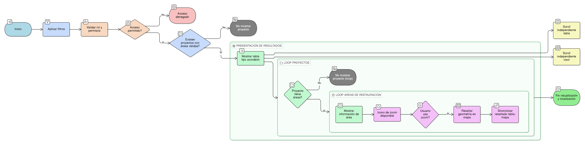

# HU-IDEAM-SNIF-REST-234

> **Identificador Historia de Usuario:** hu-ideam-snif-rest-234\
> **Nombre Historia de Usuario:** Visualización de resultados de consulta por Áreas de Restauración

> **Sistema de información:** Sistema Nacional de Información Forestal\
> **Módulo / subsistema:** Módulo de restauración\
> **Validador temático(s):** Raymond Alexander Jiménez Arteaga

## DESCRIPCIÓN HISTORIA DE USUARIO

> **Como:** usuario del visor.\
> **Quiero:** ver los resultados de áreas de restauración en una tabla estructurada.\
> **Para:** analizar su información y localizarlas en el mapa.

## CRITERIOS DE ACEPTACIÓN

1. **Presentación de resultados**\
   1.1 Los resultados de la consulta deben mostrarse en una tabla tipo acordeón con la siguiente estructura:
   - Nivel 1: Proyecto.
   - Nivel 2: Áreas de restauración.

2. **Información mostrada por área de restauración**\
   2.1 Cada área de restauración debe mostrar como mínimo:
   - Descripción.
   - Proyecto.
   - Superficie (ha).
   - Ecosistema.
   - Estado.
   - Ícono de zoom al mapa.

3. **Validaciones de negocio**\
   3.1 La acción de zoom debe resaltar únicamente la geometría del área de restauración seleccionada.\
   3.2 Si un proyecto no tiene áreas de restauración que cumplan con los filtros aplicados, no debe mostrarse en los resultados.

4. **Experiencia de usuario (UX)**\
   4.1 El comportamiento de la tabla debe ser consistente con la visualización de resultados por proyecto.\
   4.2 El resaltado debe estar sincronizado entre la tabla y el mapa.\
   4.3 La tabla de resultados y el visor geográfico deben contar con scroll independiente.

## ROLES

- **Administrador IDEAM**: Puede realizar la acción.
- **Registrador**: Puede realizar la acción.
- **Consulta**: Puede realizar la acción.

## RESTRICCIONES Y LÍMITES

- Los resultados visualizados dependen de los filtros aplicados en la consulta.
- Solo se muestra información acorde al rol y permisos del usuario.
- El visor geográfico se utiliza únicamente como apoyo para la localización de resultados.

## DIAGRAMA DE FLUJO DEL PROCESO

