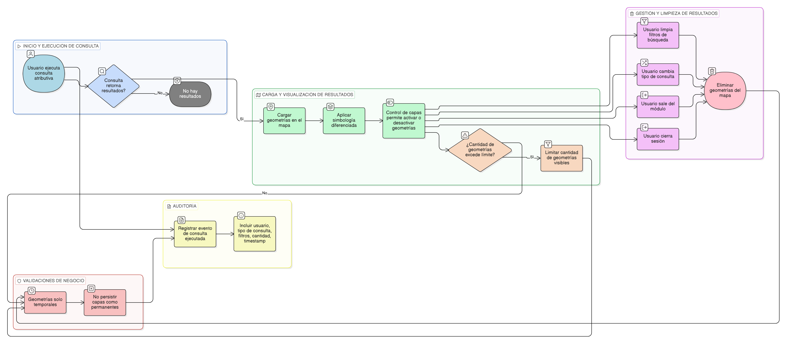

# HU-IDEAM-SNIF-REST-235

> **Identificador Historia de Usuario:** hu-ideam-snif-rest-235\
> **Nombre Historia de Usuario:** Integración de la consulta atributiva con el visor geográfico

> **Sistema de información:** Sistema Nacional de Información Forestal\
> **Módulo / subsistema:** Módulo de restauración\
> **Validador temático(s):** Raymond Alexander Jiménez Arteaga

## DESCRIPCIÓN HISTORIA DE USUARIO

> **Como:** usuario del visor.\
> **Quiero:** que los resultados de la consulta se reflejen en el mapa.\
> **Para:** analizar espacialmente la información consultada.

## CRITERIOS DE ACEPTACIÓN

1. **Carga de resultados en el visor geográfico**\
   1.1 Al ejecutar la búsqueda, el sistema debe cargar temporalmente en el mapa las geometrías resultantes de la consulta.

2. **Comportamiento de las geometrías de resultados**\
   2.1 Las geometrías cargadas deben contar con una simbología diferenciada respecto a otras capas del visor.\
   2.2 Las geometrías de resultados deben poder activarse o desactivarse desde el control de capas.

3. **Limpieza de resultados**\
   3.1 Al limpiar los filtros de búsqueda, el sistema debe eliminar las geometrías de resultados del mapa.

4. **Validaciones de negocio**\
   4.1 Las capas de resultados no deben persistirse como capas permanentes.\
   4.2 El sistema debe limitar la cantidad de geometrías visibles para garantizar el rendimiento.
   4.3 Las capas de resultados deben eliminarse automáticamente al:
   - Cambiar el tipo de consulta.
   - Salir del módulo.
   - Cerrar sesión.

5. **Auditoría**\
   5.1 El sistema debe registrar el evento **Consulta atributiva ejecutada**.\
   5.2 El registro del evento debe incluir como mínimo:
   - Usuario.
   - Tipo de consulta.
   - Filtros aplicados.
   - Cantidad de resultados.
   - Timestamp.

## ROLES

- **Administrador IDEAM**: Puede realizar la acción.
- **Registrador**: Puede realizar la acción.
- **Consulta**: Puede realizar la acción.

## RESTRICCIONES Y LÍMITES

- Las geometrías de resultados se manejan únicamente de forma temporal.
- La visualización en el mapa depende de los filtros aplicados y del rol del usuario.
- El visor geográfico se utiliza como herramienta de apoyo para el análisis espacial.

## DIAGRAMA DE FLUJO DEL PROCESO

