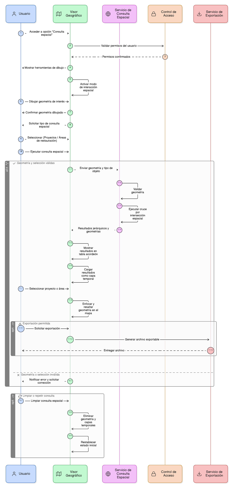

# Épica 025: Consulta Espacial en el Visor Geográfico

## 1. Descripción general

Esta épica define la funcionalidad de consulta espacial desde el visor geográfico del módulo de restauración del SNIF, permitiendo a los usuarios identificar proyectos y áreas de restauración que intersectan un área de interés definida directamente sobre el mapa.

La consulta espacial se basa en la interacción directa con el visor geográfico, mediante el dibujo de geometrías y la ejecución de cruces espaciales automáticos con la información registrada en el sistema, garantizando consistencia entre la visualización cartográfica y los resultados tabulares.

La épica permite:

- Definir áreas de interés mediante geometrías dibujadas en el visor.
- Realizar cruces espaciales por intersección.
- Consultar proyectos o áreas de restauración según la necesidad del análisis.
- Visualizar resultados jerárquicos y georreferenciados.
- Integrar los resultados como capas temporales del visor.
- Exportar los resultados en formatos geoespaciales y tabulares estándar.

## 2. Objetivo

Permitir a los usuarios del módulo de restauración del SNIF realizar consultas espaciales desde el visor geográfico, con el fin de:

- Identificar proyectos y áreas de restauración que intersectan un área de interés.
- Facilitar el análisis territorial mediante interacción directa con el mapa.
- Integrar resultados espaciales con el visor geográfico.
- Visualizar información estructurada y georreferenciada.
- Exportar resultados para análisis externo y uso en otros sistemas.

## 3. Historias de usuario asociadas

- [**HU-IDEAM-SNIF-REST-236:** Acceso a la consulta espacial](EP-IDEAM-SNIF-REST-025/HU-IDEAM-SNIF-REST-236.md)
- [**HU-IDEAM-SNIF-REST-237:** Dibujo de geometría para consulta espacial](EP-IDEAM-SNIF-REST-025/HU-IDEAM-SNIF-REST-237.md)
- [**HU-IDEAM-SNIF-REST-238:** Selección del tipo de objeto a consultar espacialmente](EP-IDEAM-SNIF-REST-025/HU-IDEAM-SNIF-REST-238.md)
- [**HU-IDEAM-SNIF-REST-239:** Cruce espacial automático con la geometría dibujada](EP-IDEAM-SNIF-REST-025/HU-IDEAM-SNIF-REST-239.md)
- [**HU-IDEAM-SNIF-REST-240:** Ejecución y limpieza de la consulta espacial](EP-IDEAM-SNIF-REST-025/HU-IDEAM-SNIF-REST-240.md)
- [**HU-IDEAM-SNIF-REST-241:** Visualización de resultados por proyectos](EP-IDEAM-SNIF-REST-025/HU-IDEAM-SNIF-REST-241.md)
- [**HU-IDEAM-SNIF-REST-242:** Visualización de áreas restauradas asociadas a un proyecto](EP-IDEAM-SNIF-REST-025/HU-IDEAM-SNIF-REST-242.md)
- [**HU-IDEAM-SNIF-REST-243:** Enfoque automático en el mapa desde los resultados](EP-IDEAM-SNIF-REST-025/HU-IDEAM-SNIF-REST-243.md)
- [**HU-IDEAM-SNIF-REST-244:** Exportación de resultados de la consulta espacial](EP-IDEAM-SNIF-REST-025/HU-IDEAM-SNIF-REST-244.md)
- [**HU-IDEAM-SNIF-REST-245:** Integración de la consulta espacial con el visor](EP-IDEAM-SNIF-REST-025/HU-IDEAM-SNIF-REST-245.md)

## 4. Riesgos

- Ejecución de consultas espaciales con geometrías extensas que afecten el rendimiento del visor.
- Inconsistencias entre los resultados tabulares y la visualización geográfica.
- Uso de geometrías inválidas o mal definidas para el cruce espacial.
- Falta de limpieza adecuada de capas temporales tras ejecutar múltiples consultas.
- Exportación de resultados sin control de volumen o formato.
- Persistencia indebida de resultados espaciales en el visor.
- Confusión del usuario entre resultados de distintas consultas espaciales.

## 5. Diagrama de secuencia

## 6. Wireframes / mockups
