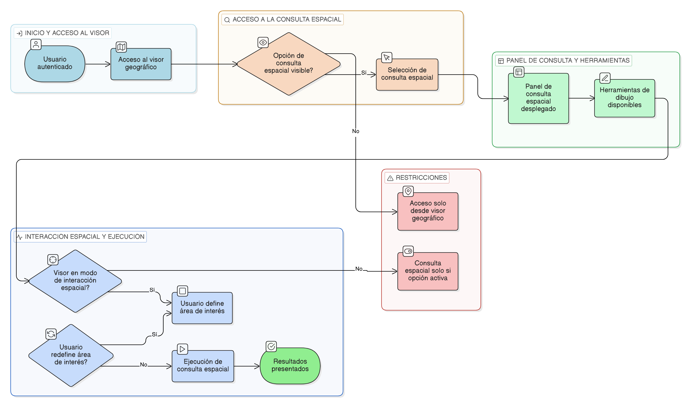

# HU-IDEAM-SNIF-REST-236

> **Identificador Historia de Usuario:** hu-ideam-snif-rest-236\
> **Nombre Historia de Usuario:** Acceso a la consulta espacial

> **Sistema de información:** Sistema Nacional de Información Forestal\
> **Módulo / subsistema:** Módulo de restauración\
> **Validador temático(s):** Raymond Alexander Jiménez Arteaga

## DESCRIPCIÓN HISTORIA DE USUARIO

> **Como:** usuario del sistema.\
> **Quiero:** acceder a la opción de consulta espacial desde el visor geográfico.\
> **Para:** realizar búsquedas de proyectos y áreas de restauración mediante geometrías dibujadas en el mapa.

## CRITERIOS DE ACEPTACIÓN

1. **Disponibilidad de la opción de consulta espacial**\
   1.1 La opción **“Consulta espacial”** debe ser visible y accesible desde el panel de consultas del visor geográfico.

2. **Despliegue del panel de consulta**\
   2.1 Al seleccionar la opción de consulta espacial, el sistema debe desplegar un panel con las herramientas de dibujo y opciones de búsqueda.

3. **Modo de interacción espacial**\
   3.1 Al activar la consulta espacial, el visor debe entrar en modo de interacción espacial para permitir la definición del área de interés.

## ROLES

- **Administrador IDEAM:** Puede realizar la acción.
- **Registrador:** Puede realizar la acción.
- **Consulta:** Puede realizar la acción.

## RESTRICCIONES Y LÍMITES

- El acceso a la consulta espacial está disponible únicamente desde el visor geográfico.
- No se permite acceder a la consulta espacial desde otros módulos del sistema.
- El visor debe entrar en modo de interacción espacial solo cuando la consulta esté activa.
- No se permite ejecutar consultas espaciales sin activar previamente la opción correspondiente.

## DIAGRAMA DE FLUJO DEL PROCESO

