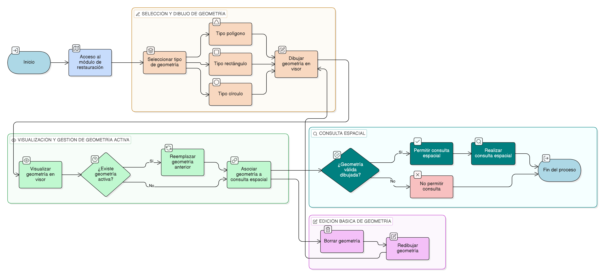

# HU-IDEAM-SNIF-REST-237

> **Identificador Historia de Usuario:** hu-ideam-snif-rest-237\
> **Nombre Historia de Usuario:** Dibujo de geometría para consulta espacial

> **Sistema de información:** Sistema Nacional de Información Forestal\
> **Módulo / subsistema:** Módulo de restauración\
> **Validador temático(s):** Raymond Alexander Jiménez Arteaga

## DESCRIPCIÓN HISTORIA DE USUARIO

> **Como:** usuario del sistema.\
> **Quiero:** dibujar una geometría directamente sobre el visor.\
> **Para:** definir el área de interés sobre la cual se realizará la consulta espacial.

## CRITERIOS DE ACEPTACIÓN

1. **Herramientas de dibujo disponibles**\
   1.1 El sistema debe permitir dibujar al menos las siguientes geometrías:
   - Polígono
   - Rectángulo
   - Círculo

2. **Visualización de la geometría**\
   2.1 La geometría dibujada debe visualizarse claramente en el visor geográfico.

3. **Gestión de geometría activa**\
   3.1 Solo una geometría activa puede estar asociada a la consulta espacial.\
   3.2 Al dibujar una nueva geometría, la geometría anterior debe ser reemplazada automáticamente.

4. **Edición básica de la geometría**\
   4.1 El sistema debe disponer de una opción para borrar o redibujar la geometría definida.

## ROLES

- **Administrador IDEAM:** Puede realizar la acción.
- **Registrador:** Puede realizar la acción.
- **Consulta:** Puede realizar la acción.

## RESTRICCIONES Y LÍMITES

- No se permite dibujar más de una geometría activa por consulta.
- La geometría anterior se reemplaza automáticamente al dibujar una nueva.
- No se permite persistir geometrías dibujadas para la consulta.
- No se permite edición avanzada de geometrías (mover vértices, dividir, unir).
- No se permite realizar la consulta sin una geometría válida dibujada.

## DIAGRAMA DE FLUJO DEL PROCESO

