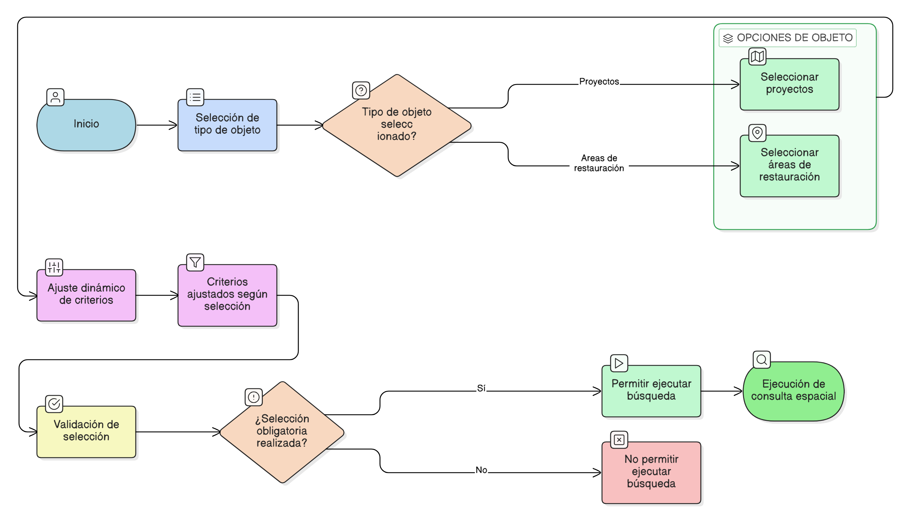

# HU-IDEAM-SNIF-REST-238

> **Identificador Historia de Usuario:** hu-ideam-snif-rest-238\
> **Nombre Historia de Usuario:** Selección del tipo de objeto a consultar espacialmente

> **Sistema de información:** Sistema Nacional de Información Forestal\
> **Módulo / subsistema:** Módulo de restauración\
> **Validador temático(s):** Raymond Alexander Jiménez Arteaga

## DESCRIPCIÓN HISTORIA DE USUARIO

> **Como:** usuario del sistema.\
> **Quiero:** elegir si la consulta espacial se realiza sobre proyectos o áreas restauradas.\
> **Para:** enfocar el cruce espacial según mi necesidad de análisis.

## CRITERIOS DE ACEPTACIÓN

1. **Selección del tipo de objeto**\
   1.1 El formulario de consulta espacial debe permitir seleccionar el tipo de objeto a consultar:
   - Proyectos
   - Áreas de restauración

2. **Ajuste dinámico de criterios**\
   2.1 Al cambiar el tipo de objeto seleccionado, el sistema debe ajustar automáticamente los criterios disponibles en el formulario.

3. **Validación previa a la búsqueda**\
   3.1 La selección del tipo de objeto es obligatoria antes de permitir la ejecución de la búsqueda espacial.

## ROLES

- **Administrador IDEAM:** Puede realizar la acción.
- **Registrador:** Puede realizar la acción.
- **Consulta:** Puede realizar la acción.

## RESTRICCIONES Y LÍMITES

- No se permite ejecutar la consulta sin definir si se consultan proyectos o áreas de restauración.
- Solo se permite seleccionar un tipo de objeto por consulta.
- Los criterios del formulario se ajustan automáticamente y no pueden ser combinados entre tipos.
- No se permite modificar el tipo de objeto mientras la consulta esté en ejecución.

## DIAGRAMA DE FLUJO DEL PROCESO

