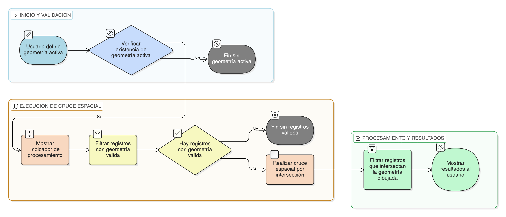

# HU-IDEAM-SNIF-REST-239

> **Identificador Historia de Usuario:** hu-ideam-snif-rest-239\
> **Nombre Historia de Usuario:** Cruce espacial automático con la geometría dibujada

> **Sistema de información:** Sistema Nacional de Información Forestal\
> **Módulo / subsistema:** Módulo de restauración\
> **Validador temático(s):** Raymond Alexander Jiménez Arteaga

## DESCRIPCIÓN HISTORIA DE USUARIO

> **Como:** usuario del sistema.\
> **Quiero:** que el sistema cruce espacialmente la geometría dibujada con la información registrada.\
> **Para:** identificar los proyectos y áreas de restauración que intersectan el área de interés.

## CRITERIOS DE ACEPTACIÓN

1. **Método de cruce espacial**\
   1.1 El cruce espacial debe realizarse utilizando intersección espacial.

2. **Validación de geometrías**\
   2.1 Solo se deben considerar registros que cuenten con geometría válida.

3. **Indicador de procesamiento**\
   3.1 El sistema debe mostrar un indicador de procesamiento durante la ejecución de la consulta espacial.

4. **Resultados del cruce**\
   4.1 El resultado de la consulta solo debe incluir registros que intersecten la geometría dibujada.

## ROLES

- **Administrador IDEAM:** Puede realizar la acción.
- **Registrador:** Puede realizar la acción.
- **Consulta:** Puede realizar la acción.

## RESTRICCIONES Y LÍMITES

- No se consideran registros sin geometría válida.
- No se permite ejecutar el cruce sin una geometría activa definida.
- El proceso de cruce es automático y no requiere intervención del usuario.
- Los resultados solo incluyen registros que intersectan completamente o parcialmente la geometría.

## DIAGRAMA DE FLUJO DEL PROCESO

