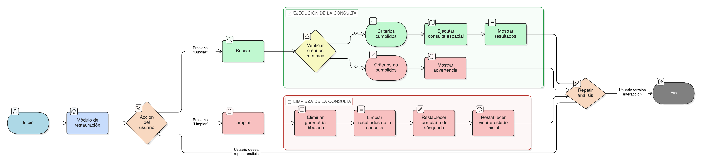

# HU-IDEAM-SNIF-REST-240

> **Identificador Historia de Usuario:** hu-ideam-snif-rest-240\
> **Nombre Historia de Usuario:** Ejecución y limpieza de la consulta espacial

> **Sistema de información:** Sistema Nacional de Información Forestal\
> **Módulo / subsistema:** Módulo de restauración\
> **Validador temático(s):** Raymond Alexander Jiménez Arteaga

## DESCRIPCIÓN HISTORIA DE USUARIO

> **Como:** usuario del sistema.\
> **Quiero:** ejecutar o limpiar la consulta espacial fácilmente.\
> **Para:** repetir el análisis con diferentes áreas de interés.

## CRITERIOS DE ACEPTACIÓN

1. **Ejecución de la consulta**\
   1.1 Debe existir un botón **Buscar** para ejecutar la consulta espacial.

2. **Limpieza de la consulta**\
   2.1 Debe existir un botón **Limpiar** que permita:
   - Eliminar la geometría dibujada.
   - Limpiar los resultados de la consulta.
   - Restablecer el formulario de búsqueda.

3. **Restablecimiento del visor**\
   3.1 Al limpiar la consulta, el visor debe volver a su estado inicial.

## ROLES

- **Administrador IDEAM:** Puede realizar la acción.
- **Registrador:** Puede realizar la acción.
- **Consulta:** Puede realizar la acción.

## RESTRICCIONES Y LÍMITES

- No se permite ejecutar la consulta sin cumplir los criterios mínimos requeridos.
- Al limpiar la consulta no se conserva ningún estado previo.
- No se permite recuperar resultados una vez ejecutada la acción de limpieza.

## DIAGRAMA DE FLUJO DEL PROCESO

