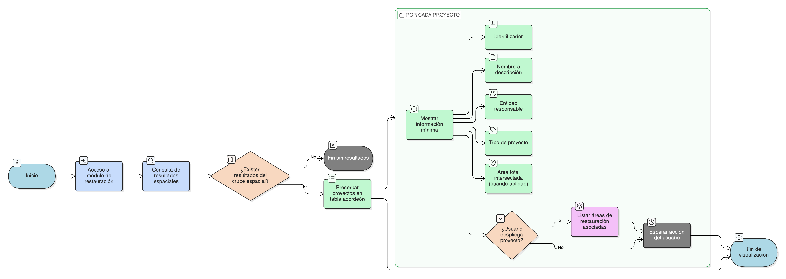

# HU-IDEAM-SNIF-REST-241

> **Identificador Historia de Usuario:** hu-ideam-snif-rest-241\
> **Nombre Historia de Usuario:** Visualización de resultados por proyectos

> **Sistema de información:** Sistema Nacional de Información Forestal\
> **Módulo / subsistema:** Módulo de restauración\
> **Validador temático(s):** Raymond Alexander Jiménez Arteaga

## DESCRIPCIÓN HISTORIA DE USUARIO

> **Como:** usuario del sistema.\
> **Quiero:** visualizar los resultados espaciales organizados por proyecto.\
> **Para:** entender el alcance territorial de los proyectos dentro del área consultada.

## CRITERIOS DE ACEPTACIÓN

1. **Presentación de resultados**\
   1.1 Los resultados deben presentarse en una tabla tipo acordeón.

2. **Información mínima por proyecto**\
   2.1 Cada proyecto debe mostrar como mínimo:
   - Identificador.
   - Nombre o descripción.
   - Entidad responsable.
   - Tipo de proyecto.
   - Área total intersectada, cuando aplique.

3. **Detalle por proyecto**\
   3.1 Al desplegar un proyecto, se deben listar sus áreas de restauración asociadas.

## ROLES

- **Administrador IDEAM:** Puede realizar la acción.
- **Registrador:** Puede realizar la acción.
- **Consulta:** Puede realizar la acción.

## RESTRICCIONES Y LÍMITES

- Los resultados se presentan únicamente en formato de tabla tipo acordeón.
- No se permite editar información de proyectos desde los resultados.
- Solo se muestra la información mínima definida para cada proyecto.
- La visualización depende exclusivamente del resultado del cruce espacial.

## DIAGRAMA DE FLUJO DEL PROCESO

