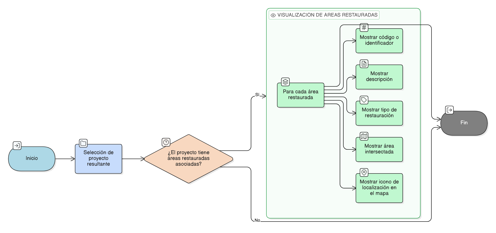

# HU-IDEAM-SNIF-REST-242

> **Identificador Historia de Usuario:** hu-ideam-snif-rest-242\
> **Nombre Historia de Usuario:** Visualización de áreas restauradas asociadas a un proyecto

> **Sistema de información:** Sistema Nacional de Información Forestal\
> **Módulo / subsistema:** Módulo de restauración\
> **Validador temático(s):** Raymond Alexander Jiménez Arteaga

## DESCRIPCIÓN HISTORIA DE USUARIO

> **Como:** usuario del sistema.\
> **Quiero:** ver las áreas de restauración relacionadas con cada proyecto resultante.\
> **Para:** analizar su distribución espacial y características básicas.

## CRITERIOS DE ACEPTACIÓN

1. **Información mínima por área restaurada**\
   1.1 Cada área restaurada debe mostrar como mínimo:
   - Código o identificador.
   - Descripción.
   - Tipo de restauración.
   - Área intersectada.

2. **Localización en el mapa**\
   2.1 Cada área restaurada debe incluir un icono de localización.

## ROLES

- **Administrador IDEAM:** Puede realizar la acción.
- **Registrador:** Puede realizar la acción.
- **Consulta:** Puede realizar la acción.

## RESTRICCIONES Y LÍMITES

- Las áreas restauradas solo se muestran si están asociadas a un proyecto resultante.
- Solo se presenta la información mínima definida para cada área.

## DIAGRAMA DE FLUJO DEL PROCESO

