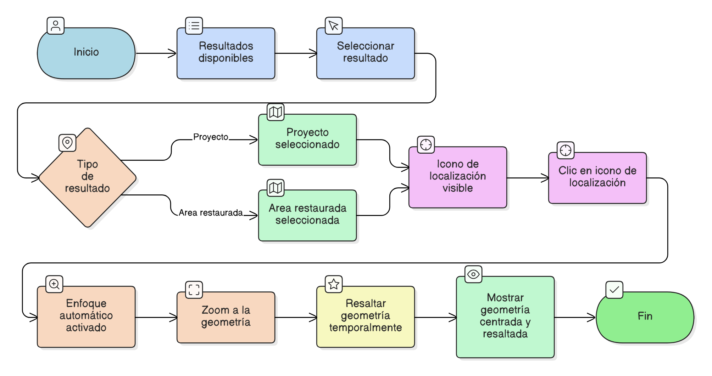

# HU-IDEAM-SNIF-REST-243

> **Identificador Historia de Usuario:** hu-ideam-snif-rest-243\
> **Nombre Historia de Usuario:** Enfoque automático en el mapa desde los resultados

> **Sistema de información:** Sistema Nacional de Información Forestal\
> **Módulo / subsistema:** Módulo de restauración\
> **Validador temático(s):** Raymond Alexander Jiménez Arteaga

## DESCRIPCIÓN HISTORIA DE USUARIO

> **Como:** usuario del sistema.\
> **Quiero:** que al seleccionar un proyecto o área restaurada el visor se acerque automáticamente.\
> **Para:** visualizar su ubicación dentro del mapa.

## CRITERIOS DE ACEPTACIÓN

1. **Interacción desde los resultados**\
   1.1 Al hacer clic en el icono de localización:
   - El mapa debe hacer zoom a la geometría correspondiente.
   - La geometría debe resaltarse visualmente.

2. **Cobertura del comportamiento**\
   2.1 El comportamiento debe aplicar tanto para proyectos como para áreas restauradas.

## ROLES

- **Administrador IDEAM:** Puede realizar la acción.
- **Registrador:** Puede realizar la acción.
- **Consulta:** Puede realizar la acción.

## RESTRICCIONES Y LÍMITES

- El enfoque automático se activa únicamente al usar el icono de localización.
- No se permite modificar la geometría durante el enfoque automático.
- El resaltado visual es temporal.

## DIAGRAMA DE FLUJO DEL PROCESO

